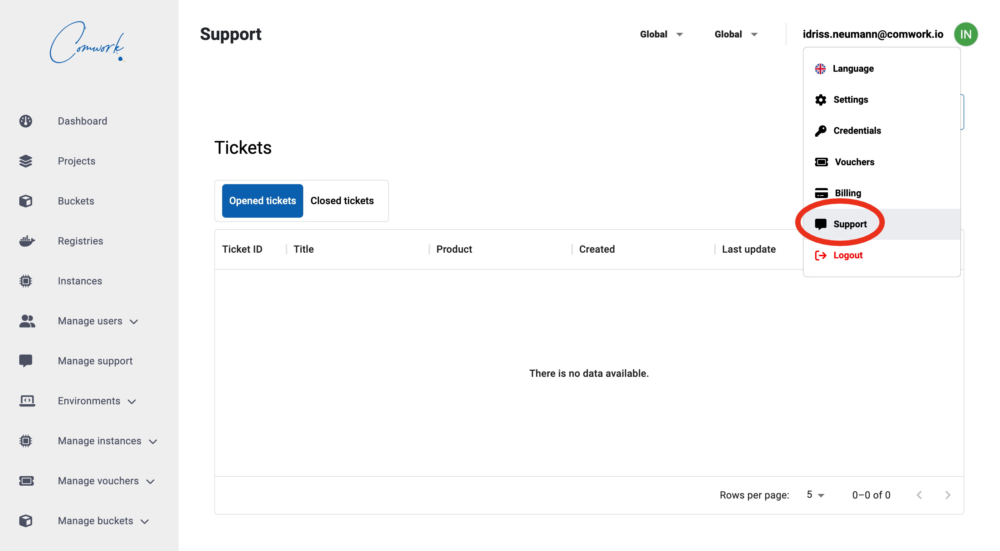
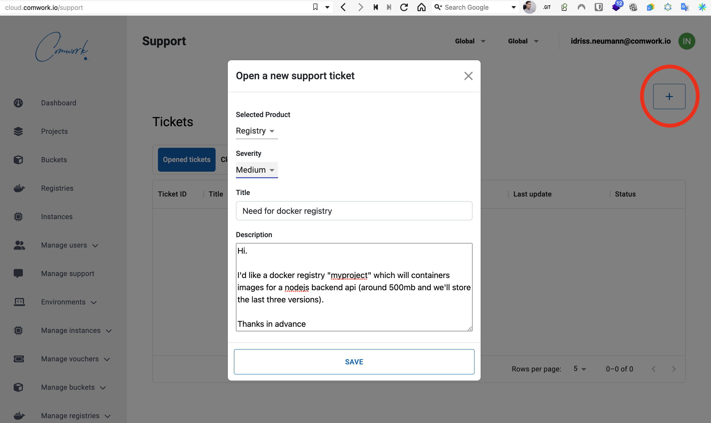
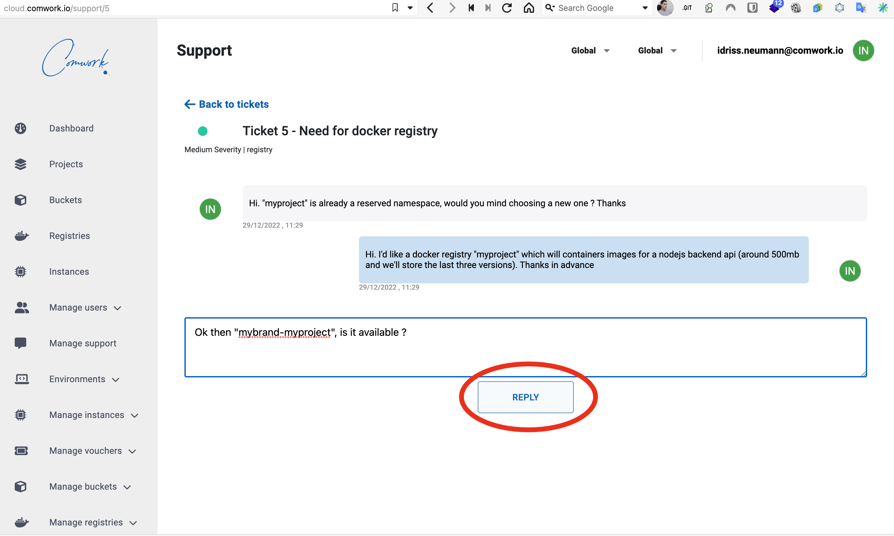

# Support

## Opening a ticket

Click on "support" on the user's menu:

Then you'll be to open a new ticket for your requests:

You have to choose the product that corresponds the most to your request (in this example it's "registry" but it could be "wordpress", whatever) and the severity according to the emmergency of this demand.

Once it's opened, check regularly if the team has answered with a question for you (status "await customer"):

Then if it's the case, answer the question:

And finally when it's done or fixed you should be able to retriev the closed ticket like this:

## Other contact's ways

We **strongly** advise you to always open tickets.

Once you opened a ticket, you can also contact-us (giving the reference of your ticket) with:

* The `cloud@comwork.io` email
* Our [Slack workspace](https://join.slack.com/t/comwork-cloud/shared_invite/zt-1h04v2jp0-cF9p53MzfzxuChVobWKQEQ) (channel `#support`)
* Our [Discord server](https://discord.gg/CXskxxPauz) (channel `#support`)
