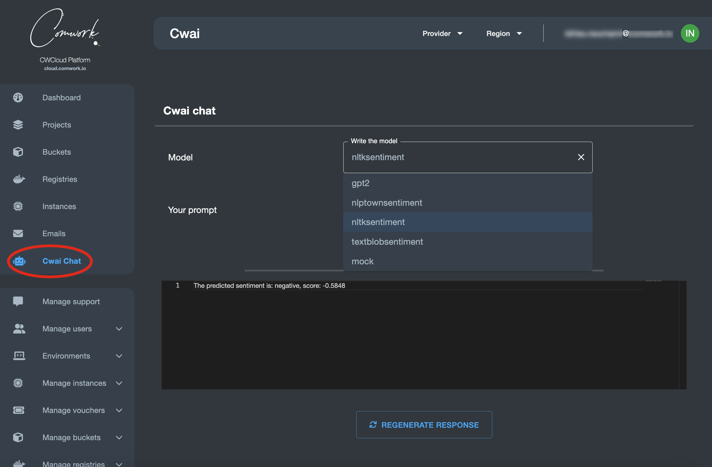

# Comwork AI

## Purpose

This feature aims to expose AI models such as LLM to be exposed as an API based on this [open source project](https://gitlab.comwork.io/oss/cwai/cwai-api).

## Enabling this API

In the SaaS version, you can ask to be granted using the [support system](./console/public/support.md).

If you're admin of the instance, you can grant users like this:


## UI chat

Once you're enabled, you can try the CWAI api using this chat web UI:



## Use the API

Of course, the main purpose is to be able to interact with those model using very simple http endpoints:


Here's how to get all the available models:

```shell
$ curl -X 'GET' 'https://cloud-api.comwork.io/v1/ai/models' -H 'accept: application/json' -H 'X-Auth-Token: XXXXXX'
```

Result:

```json
{
  "models": [
    "gpt2",
    "nlptownsentiment",
    "mock"
  ],
  "status": "ok"
}
```

Then prompting with one of the available models:

```shell
curl -X 'POST' \
  'https://cloud-api.comwork.io/v1/ai/prompt' \
  -H 'accept: application/json' \
  -H 'Content-Type: application/json' \
  -H 'X-Auth-Token: XXXXXX' \
  -d '{
  "model": "nlptownsentiment",
  "message": "This is bad !",
  "settings": {}
}'
```

The answer would be:

```json
{
  "response": [
    "The predicted emotion is: Anger"
  ],
  "score": 1,
  "status": "ok"
}
```

Notes: 
* you have to replace the `XXXXXX` value with your own token generated with [this procedure](./api/api_credentials.md).
* you can replace `https://cloud-api.comwork.io` by the API's instance URL you're using. For the Tunisian customers for example, it would be `https://api.cwcloud.tn`.

## Driver interface

If you fork the cwai API, you can implement you're own driver that will load and generate answer from models implementing [this abstract](https://gitlab.comwork.io/oss/cwai/cwai-api/-/blob/main/src/drivers/model_driver.py):

```python
class ModelDriver(ABC):
    @abstractmethod
    def load_model(self):
        pass

    @abstractmethod
    def generate_response(self, prompt: Prompt):
        pass
```

Then add your model in the `ENABLED_MODELS` environment variable.

In the future we'll propose a web GUI to upload your own drivers on the web console. In the meantime you can ask comwork via the [support system](./console/public/support.md).
