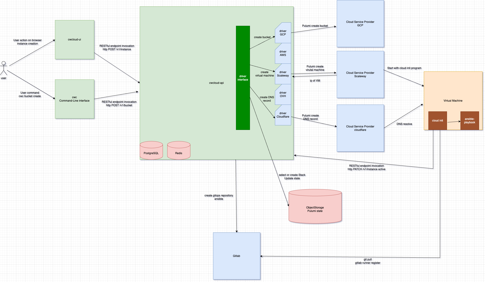
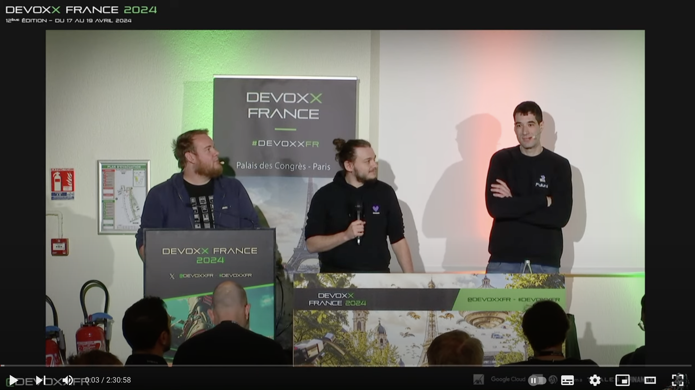

# Deployment as a Service

## Translations

This tutorial is also available in the following languages:
* [Français 🇫🇷](../translations/fr/tutorials/daas.md)

## Definition

_DaaS_ for _Deployment as a service_ is a compromise between the _IaaS_ and the _PaaS_. You have the ability:
* to provision ready-to-use managed services from a modern web-console (_PaaS_)
* to update your deployments scripts and template[^3] in a gitops way (_IaaS_)
* to orchestrate those deployments through an API and CLI alongside other common cloud components such as OCI registries, object storages... (_IaaS_)

[^1]: _Infrastructure as a service_
[^2]: _Platform as a service_
[^3]: ansible roles and playbooks for VM, helm charts for Kubernetes

## How it works

Here's a schema explaining how the DaaS is working using virtual machines:

And how it's working with Kubernetes:

You can also check-out this [DevoxxFR](https://www.devoxx.fr)'s university we gave to explain how the DaaS of cwcloud is working:

## Examples

You'll find various examples and demo in this playlist:

