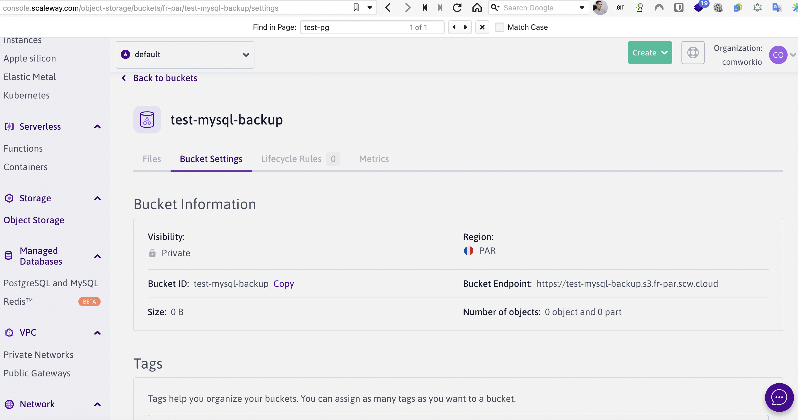
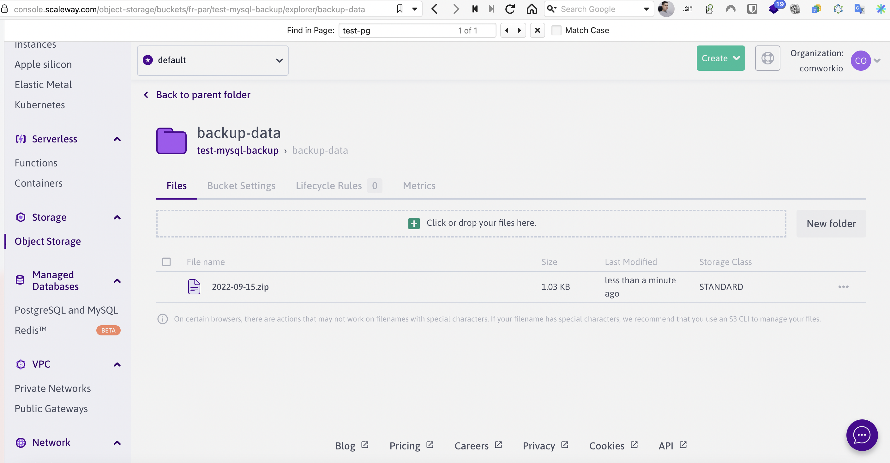

# Backups on object storage

## Translations

This tutorial is also available in the following languages:
* [Français 🇫🇷](../../translations/fr/tutorials/dbaas/backups.md)

## Procedure

This tutorial will show you how to backup your databases using the [`backup-bucket`](https://gitlab.comwork.io/oss/bucket-backup) opensource project we're providing for this purpose.

1. Create your bucket on your favorite cloud provider

Example on scaleway:



You can ask for getting a bucket handled by CwCloud following [this procedure](../../storage.md)

2. Import this opensource [ansible role](https://gitlab.comwork.io/oss/bucket-backup/-/tree/main/ansible-bucket-backup) in the `roles/` folder of your gitlab IaC[^1] project (name-it `bucket-backup` instead of `ansible-bucket-backup`)

3. You can change the backup frequency directly in the [`ansible-bucket-backup/tasks/main.yml`](https://gitlab.comwork.io/oss/bucket-backup/-/blob/main/ansible-bucket-backup/tasks/main.yml):


```yaml
- name: Creates backup cron
  ansible.builtin.cron:
    name: backup cron
    minute: "0"
    hour: "3"
    user: root
    job: "bash {{ node_home }}/bucket-save.sh"
    cron_file: ansible_bucket_backup
```

By default it's each day at 3.00am.

4. If you're on MySQL/MariaDB, here's the configuration for a single database:

```yaml
backup_date_format: "+%Y%m%d"
bucket_endpoint: "https://s3.fr-par.scw.cloud" # change-it by your provider
bucket_access_key: changeit
bucket_secret_key: changeit
bucket_name: test-mysql-backup # change-it by your bucket name
backup_folder: /home/backups
backup_inside_container: /db-data
backup_cmd: "mysqldump -h {your_instance_hash}.mariadb.comwork.(cloud|dev|info) -u your_user -p'your_password' --databases your_db > /home/backups/backup.sql"
zip_compress_backup_enable: true
backup_zip_file_folder: /home/backups/tmp
backup_src_file_to_clean: '*.sql'
backup_max_retention: 3 # number of retention days you can re-adjust
```

If you're on PostgreSQL:

```yaml
backup_date_format: "+%Y%m%d"
bucket_endpoint: "https://s3.fr-par.scw.cloud" # change-it by your provider
bucket_access_key: changeit
bucket_secret_key: changeit
bucket_name: test-pgsql-backup # change-it by your bucket name
backup_folder: /home/backups
backup_inside_container: /db-data
backup_cmd: "pg_dumpall -U backup > /home/backups/backup.sql"
zip_compress_backup_enable: true
backup_zip_file_folder: /home/backups/tmp
backup_src_file_to_clean: '*.sql'
backup_max_retention: 3 # number of retention days you can re-adjust

postgresql_roles:
  - username: backup
    password: changeit
```

5. Add the role in your `playbook-{instance_name}.yml` file:

```yaml
- hosts: localhost
  roles:
   - common
   - fail2ban
   - sudo
   - ssh
   - cloud-instance-ssh-keys
   - firewall
   - kinsing
   - docker
   - imalive
   - mariadb # this example is for MySQL/MariaDB, put the backup role after the db installation
   - bucket-backup # here !
   - gw-letsencrypt
   - nginx
   - gitlab-runner
```

6. Add the role in the `.gitlab-ci.yml` file:

```yaml
mysql:
  stage: deploy
  script:
    - chmod +x ./install.sh
    - ./install.sh -e mysql
  only:
    refs:
      - /^(main.*)$/
    changes:
      - env/mysql.yml
      - roles/common/**/*
      - roles/ssh/**/*
      - roles/cloud-instance-ssh-keys/**/*
      - roles/fail2ban/**/*
      - roles/sudo/**/*
      - roles/firewall/**/*
      - roles/kinsing/**/*
      - roles/docker/**/*
      - roles/imalive/**/*
      - roles/mariadb/**/* # this example is for MySQL/MariaDB, put the backup role after the db installation
      - roles/bucket-backup/**/* # here !
      - roles/gw-letsencrypt/**/*
      - roles/gw-nginx/**/*
      - roles/gitlab-runner/**/*
      - install.sh
      - playbook-mysql.yml
  tags:
    - mysql-hmcffu
```

Push-it and that's it.

You also run the backup manually this way (on your instance with [ssh](../ssh.md)):

```shell
$ sudo su -
$ /root/bucket-save.sh
```

You'll see the result in your bucket:



[^1]: infrastructure as code
