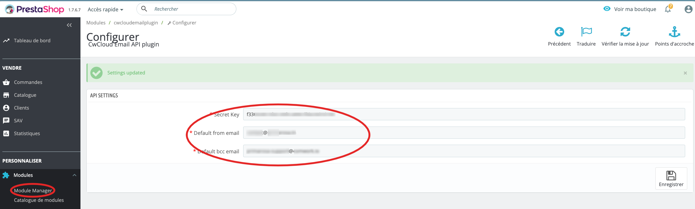

# Email API

## Translations

This tutorial is also available in the following languages:
* [Français 🇫🇷](../translations/fr/tutorials/emailapi.md)

## Enabling this API

In the SaaS version, you can ask to be granted using the [support system](./console/public/support.md).

If you're admin of the instance, you can grant users like this:


## UI form

Once you're enabled, you can try to send emails using this web UI:


## Use the API

You can use this endpoint in your applications in order to send emails:


Here's how to use this endpoint using `curl`:

```shell
curl -X 'POST' \
  'https://cloud-api.comwork.io/v1/email' \
  -H 'accept: application/json' \
  -H 'Content-Type: application/json' \
  -H 'X-Auth-Token: XXXXXX' \
  -d '{
    "from": "cloud@provider.com",
    "to": "recipient@provider.com",
    "bcc": "bcc@provider.com",
    "subject": "Subject",
    "content": "Content"
  }'
```

Notes:
* If you're on the Tunisian version, replace `cloud-api.comwork.io` by `api.cwcloud.tn`
* You have to replace the value `XXXXXX` with your own token generated with [this procedure](./api/api_credentials.md)

# Attachment

It's possible to join a file in the email content with the optional bloc `attachment`:

```shell
curl -X 'POST' \
  'https://cloud-api.comwork.io/v1/email' \
  -H 'accept: application/json' \
  -H 'Content-Type: application/json' \
  -H 'X-Auth-Token: XXXXXX' \
  -d '{
    "from": "cloud@provider.com",
    "to": "recipient@provider.com",
    "bcc": "bcc@provider.com",
    "subject": "Subject",
    "content": "Content",
    "attachment": {
      "mime_type": "application/pdf",
      "file_name": "invoice.pdf",
      "b64": "base64content"
    }
  }'
```

Notes:
* You'll have to encode the file content in base64 before copying it inside the `b64` field. On Linux and Mac, you can use the command `base64 -i invoice.pdf` and get the output.

## CMS plugins

### Wordpress

#### Installation and configuration

You can use this [plugin](https://gitlab.comwork.io/oss/cwc/cwcloud-wordpress-email):

**1/** Download the right zip extension file (either the `-io` if you're using cloud.comwork.io instance of `-tn` if you're using the cwcloud.tn instance)


**2/** Configure the extension:

Generate API credentials. You can see [this tutorial](./api/api_credentials.md)

And copy paste the secret key here:


#### Debugging

Open a bash session on the wordpress container, install `vim` and open the `cwcloud-email-plugin.php` file:

```shell
$ docker exec -it wp_app /bin/bash
root@4d9443458fed$ apt update -y
root@4d9443458fed$ apt install -y vim
root@4d9443458fed$ vim wp-content/plugins/cwcloud-email-plugin-tn/cwcloud-email-plugin.php
```

Add the following line:

```php
// ...

function cwcloud_email_send($phpmailer) {
    $api_endpoint = 'https://api.cwcloud.tn/v1/email';

    $from_addr = $phpmailer->From;
    $to_addr = $phpmailer->AddAddress ? $phpmailer->AddAddress : $from_addr;
    $bcc_addr = $phpmailer->AddBCC ? $phpmailer->AddBCC : null;

    # This one
    error_log(sprintf("CWCLOUDEMAIL from = %s, to = %s, bcc = %s", $from_addr, $to_addr, $bcc_addr));

    // ...
}

// ...
```

Then, exit and monitor the container logs and replay the sending mail scenario that doesn't work. It'll indicate if there's some mandatory information's missing or if you're even invoking the wordpress `phpmailer`.

```shell
docker logs wp_app -f 2>&1 | grep CWCLOUDEMAIL
```

### Prestashop

You can use this [plugin](https://gitlab.comwork.io/oss/cwc/cwcloud-prestashop-email):

**1/** Download the right zip extension file (either the `-io` if you're using cloud.comwork.io instance of `-tn` if you're using the cwcloud.tn instance)


The upload it, you'll be able to see and configure it here:


**2/** Configure the plugin:

Generate API credentials. You can see [this tutorial](./api/api_credentials.md)

And copy paste the secret key here:



You'll have also to choose a default bcc and from email address.
