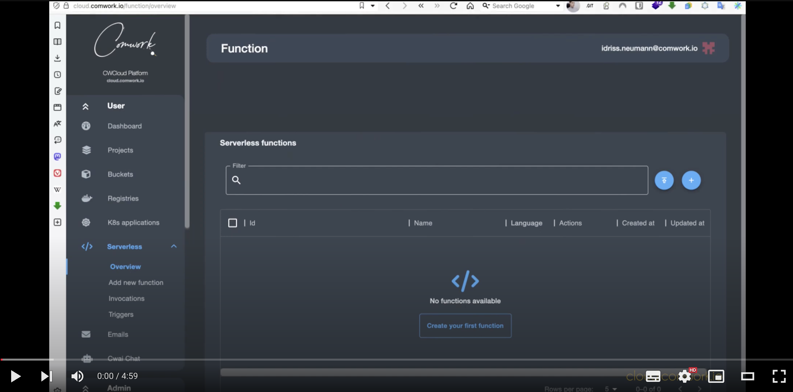

# Serverless / FaaS tutorials

## Video tutorial

Here's a 5 min tutorials that will show you how to use our FaaS engine:

## Written tutorials

* [How to create a serverless function](./how_to_create_a_function.md)
* [How to create MQTT callback to connect with Hive MQ cluster](./how_to_create_mqtt_hive_mq.md)
* [How to create MQTT callback to connect with Scaleway IoT Hub device](./how_to_create_mqtt_scaleway.md)
