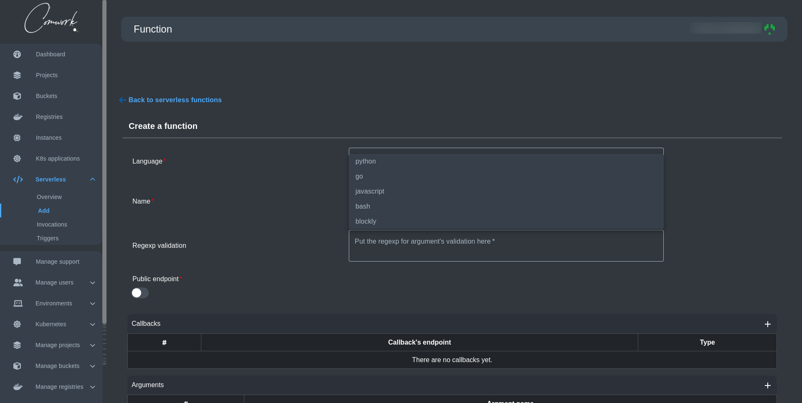
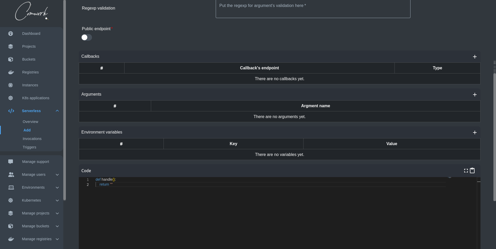
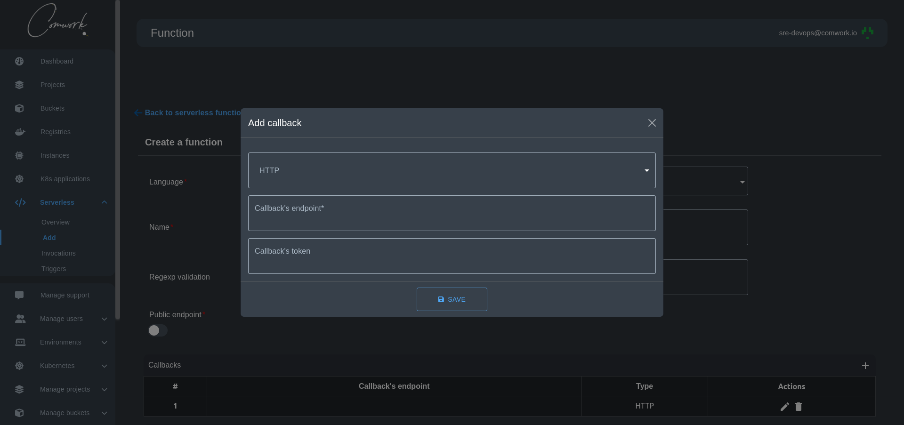
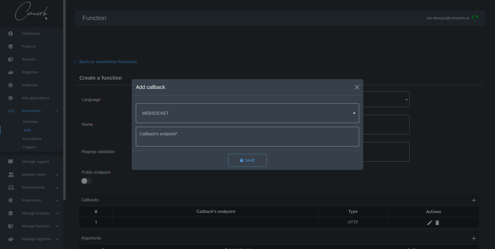
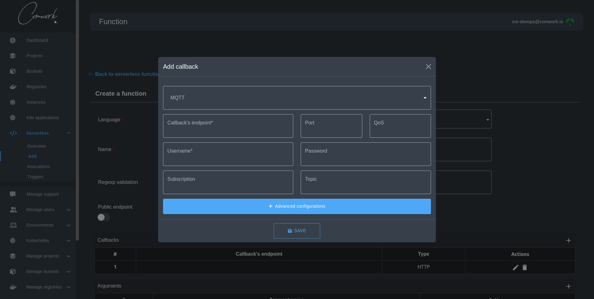
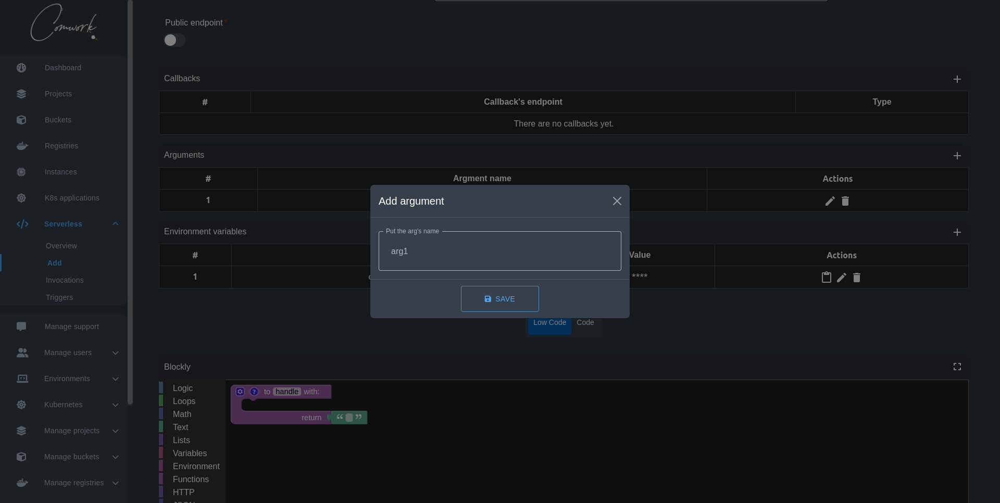
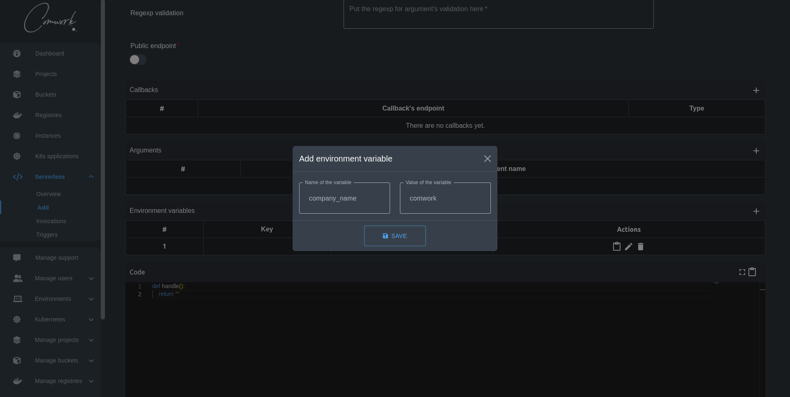
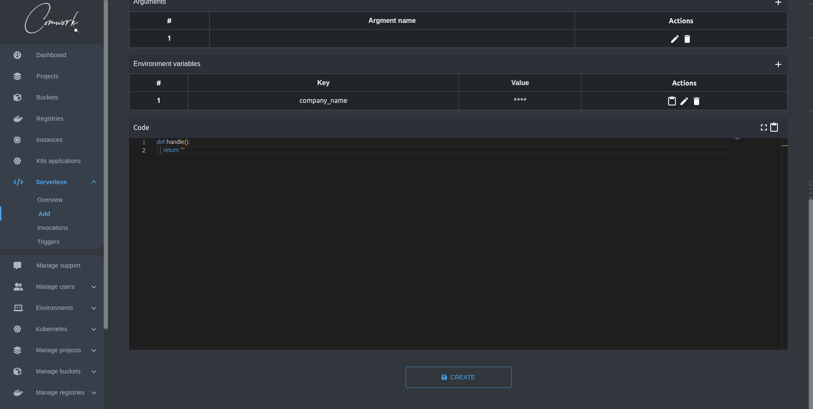

# How to create a serverless function

A serverless function, is a piece of code that is executed in response to an event, such as a user action or a database update. It's __"serverless"__ because the infrastructure it runs on is managed by a cloud provider, abstracting away the need for server management from the developer.

## Demo

Here's our latest demo showing how to create a nested serverless functions with environment variables (we will talk about that in the upcoming sections)

[](https://www.youtube.com/watch?v=J6t95NXQGnM)

## Step 1: Choose your programming language and name your function



First, you need to choose the most programming language you're more comfortable with to write your serverless function. Currently the supported languages are:

- Python
- Go
- JavaScript
- bash
- [blockly](#Blockly)

Second, you need to enter the name of your function, and that's it! you can pass directly to write your function now.

### Blockly

You can get access to our Blockly feature by choosing blockly in the programming languages dropdown.

Blockly is a visual programming editor developed by Google, using drag-and-drop blocks to represent code concepts. It powers many popular coding education programs and IoT projects.

### Demo

Here's our latest demo showing how you can create a low-code serverless function using Blockly editor.

[](https://youtu.be/ikBNQmlXJY8)

## Step 2: Configure your function parameters (Optional)



Before you start writing your function you might need to add some configurations that can help you with your function creation.

### Regexp validation

This input is for the regexp for argument's validation.

### Public endpoint

By default, the function is private but you can make it public so other users can you use it too.

### Callbacks

You can add callback to send the payload holding the data about the function and its result to the callback endpoint.

The current callbacks available types are:

- HTTP
- WebSocket
- MQTT

### HTTP



### WebSocket



### MQTT



[How to create an MQTT callback with Hive MQ](./how_to_create_mqtt_hive_mq.md)
[How to create an MQTT callback with Scaleway IoT Hub](./how_to_create_mqtt_scaleway.md)

### Arguments



You can add an argument by clicking on the + icon where it will show you a modal to add your argument name.

The arguments will be added automatically to the handle function on your editor.

### Environment variables



You can add an environment variable by clicking on the + icon where it will show you a modal to add your environment variable key and value. Then you can use them in your code by writing them in the follwing form:

```shell
"{{ env['key'] }}"
```

Of course you can edit, delete, and copy to them in the form `key=value`

## Step 3: Write your function !



We're providing you with a moderne editor that highlight your code according to the programming language you chose earlier. You can also copy the written code or go full-screen mode for a better concentration.

After you finish writing your function hit create and your're done :) .
