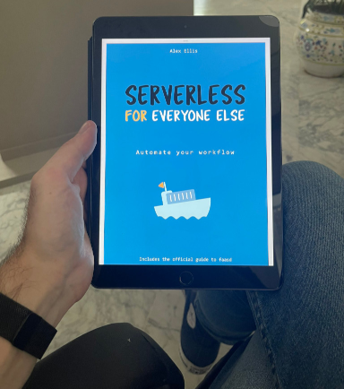
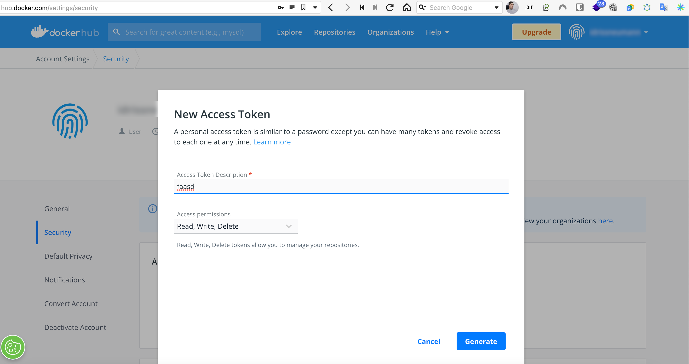
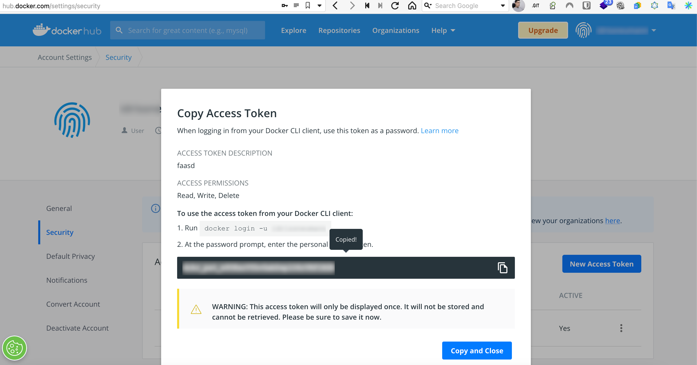
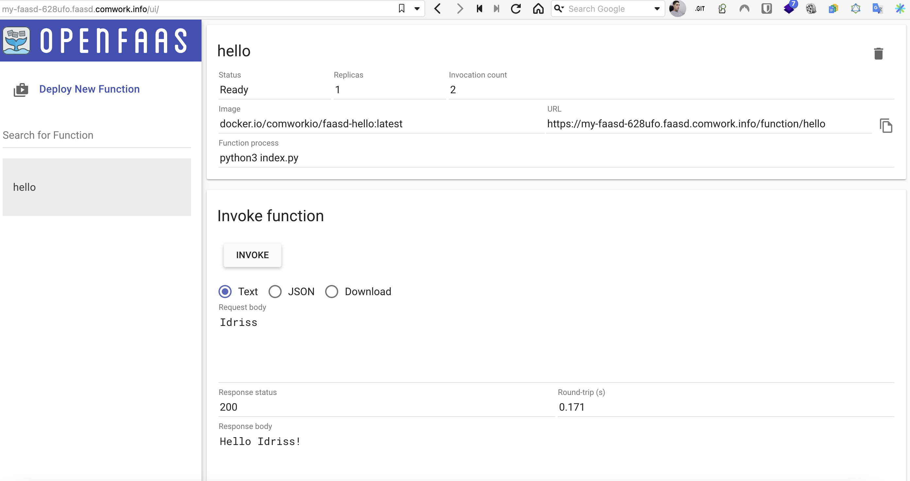

# OpenFaaS / Faasd

## Disclaimer

In this tutorial, we'll give you some insights on how to:
* deploy a faasd server with comwork cloud
* deploy a dummy function in the context of using this cloud service

We do not want to replace the amazing job done by the OpenFaaS team. So if you want to really use Faasd in a production context, we strongly advise you to:

* Get the ["Serverless for everyone else" book](https://openfaas.gumroad.com/l/serverless-for-everyone-else) from Alex Ellis (founder of OpenFaaS and Faasd) which explain everything you need to know for using the OpenFaaS CLI (`faas-cli`) and setting up a faasd server by yourself. It's not expensive and it's worth it, trust us!
* Check the OpenFaaS CLI public documentation [here](https://docs.openfaas.com) which is also pretty great



_You'll see it's very quick and very pleasant to read on any devices support_

## Video tutorial

[](https://youtu.be/ttwhWnbmfa8)

You can activate the subtitles in English or French to get more details on this demo. 

Enjoy!

## The OpenFaaS CLI (faas-cli)

Let's assume in this tutorial you deployed a Faasd instance with the following public url: `https://pmy-faasd-628ufo.faasd.comwork.info`

### Install and connect to the server

Install the faas cli if it's not already done:

```shell
curl -sSL https://cli.openfaas.com | sudo sh
```

### Authentication to the faasd server

```shell
export OPENFAAS_URL=https://my-faasd-628ufo.faasd.comwork.info # replace the public url with your own one
faas-cli login --username cloud --password YOUR_PASSWORD
```

You'll find the password in the ansible environment file (`env/{ instance_hash }.yml`):

```yaml
faasd_user: cloud
faasd_password: YOUR_PASSWORD
```

### Authentication to docker hub registry

In order to push your functions (which are built on top of containers), you need an OCI container registry such as [docker hub](https://hub.docker.com).

Create a free account and an access token:





Then:

```shell
faas-cli registry-login --username YOUR_DOCKERHUB_USERNAME --password YOUR_DOCKERHUB_ACCESS_TOKEN
```

Note: you can use registries on Scaleway or OVH using [comwork cloud](../storage.md)

### Deploy a function with faas-cli

Here's an exemple of function created from template in Python3:

```shell
$ faas-cli new hello --lang python3
$ ls -l hello*
-rw------- 1 ineumann staff 157 Sep  3 10:05 hello.yml

hello:
total 4
-rw-r--r-- 1 ineumann staff   0 Sep  3 10:05 __init__.py
-rw-r--r-- 1 ineumann staff 123 Sep  3 10:05 handler.py
-rw-r--r-- 1 ineumann staff   0 Sep  3 10:05 requirements.txt
```

Change the `hello/handler.py` file:

```python
def handle(req):
    """handle a request to the function
    Args:
        req (str): request body
    """

    return "Hello {}!".format(req)
```

Change the `hello.yml` to add a full container registry image path in the `image` field, and the `gateway` field:

```yaml
version: 1.0
provider:
  name: openfaas
  gateway: https://my-faasd-628ufo.faasd.comwork.info
functions:
  hello:
    lang: python3
    handler: ./hello
    image: comworkio/faasd-hello:latest
```

Then build and deploy:

```shell
$ faas-cli up -f ./hello.yml
```

If you're not on a x86/amd64 computer (like an Apple Silicon for example), use thoses commands instead:

```shell
$ faas-cli publish -f ./hello.yml --platforms linux/amd64
$ faas-cli deploy -f ./hello.yml
```

Then you'll be able to invoke your function:

```shell
$ curl -X POST "https://my-faasd-628ufo.faasd.comwork.info/function/hello" -d "Idriss"
Hello Idriss!
```

And see it and invoking it from the GUI:


