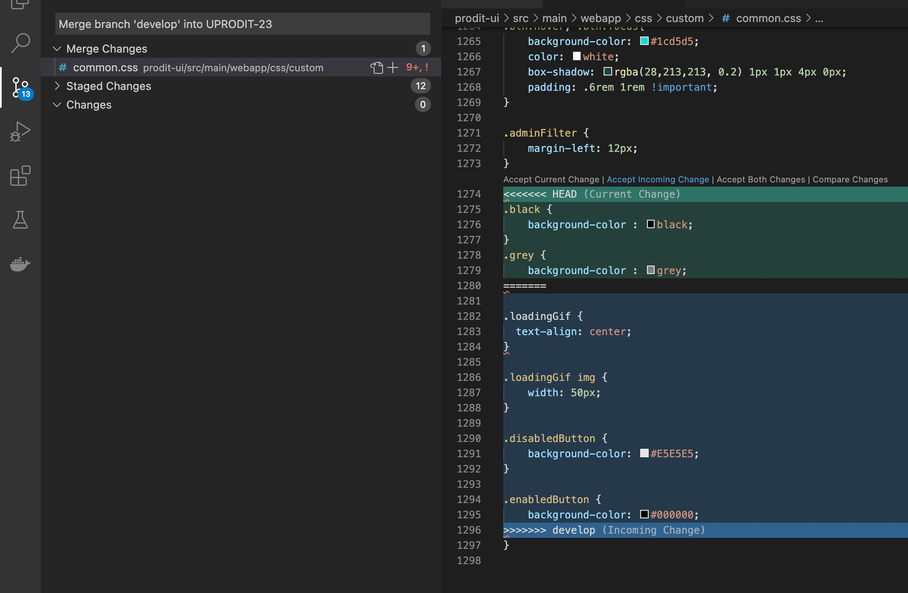
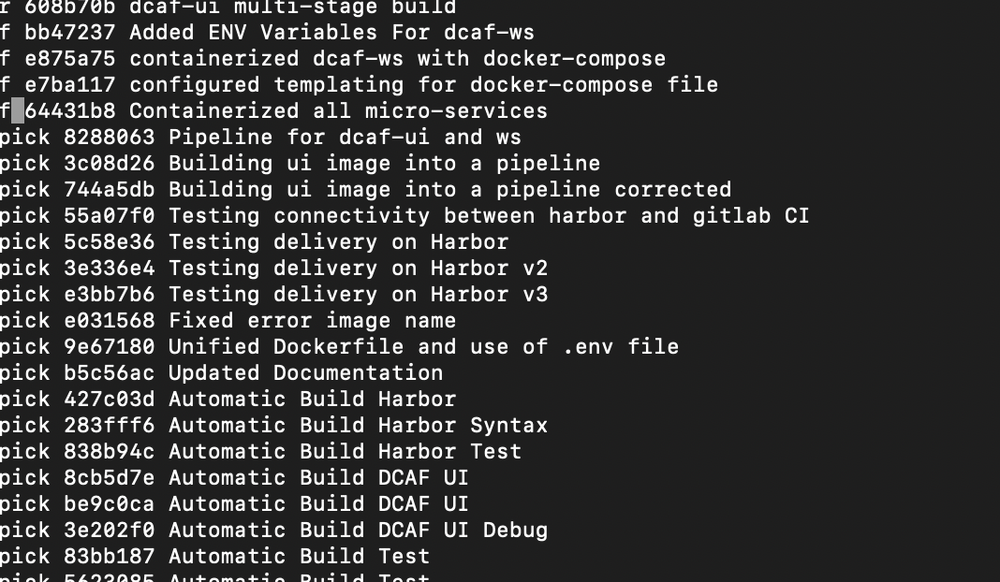
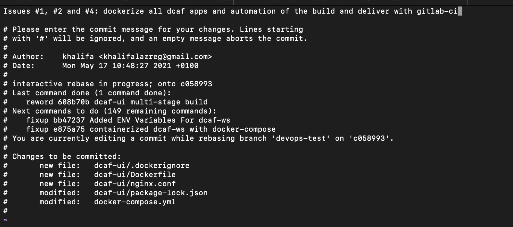

# Git tutorial

## Disclaimer

This tutorial is a translation of this [training repository](https://gitlab.comwork.io/comwork_public/training/git) (which was originaly written in French).

If you're a French speaker, you'll find there more resources (slides with git flows, etc).

## Downloading/cloning a repository

```shell
git clone <repository url>
```

## Creating a branch

All branches must start from the `main` branch (previously the `master` branch but you can rename your default protected branch all you want, we'll keep `main` in this tutorial). 

```shell
git pull --rebase origin main
git checkout -b <feature or bug ticket number>
git push origin <feature or bug ticket number>
```

## Updating a branch

```shell
git pull --rebase origin <feature or bug ticket number>
```

## Commit and push on a branch

It's important to do it regularly and not waiting for too much changes.

Warning: the commit doesn't reflect the modifications on the remote git server. It is the push operation that will do so.

```shell
git add . # à la racine du repo
git commit -m "<numéro de la branche ou ticket> commentaire"
git push origin <numéro de la branche ou ticket>
```

## Stash

`stash` is usefull to keep a changes in sort of clipboard without making a commit revision in your history.

```shell
git stash
git stash list # list the existing stash
git stash pop <stash id> # take out the changes from the stash (generally in order to commit) 
git stash pop # take out all the changes that had been stashed
git stash clear # emptying the stash stack
```

## Gestion des conflits lors de la mise à jour d'une branche

Les conflits apparaissent à la suite de la commande `git pull --rebase origin <numéro de la branche ou ticket>`

```shell
CONFLIT (contenu) : Conflit de fusion dans FILENAME
CONFLICT (content): Merge conflict in FILENAME
```

Il faut alors régler les conflits sur tous les fichiers indiqués. Pour cela utilisez votre IDE préféré qui a probablement une fonctionnalité de type git > resolved conflicts. Faites bien attention de prendre la bonne version des lignes en conflits et ajouter les fichiers dans le conflit a été résolu.

Voici un exemple avec visual studio code:



* Cliquer sur `Accept Incoming Change` si la version de la branche de référence (`main`) est plus à jour que votre version locale

* Cliquer sur `Accept Current Change` si votre version locale est plus à jour que celle de la branche de référence (`main`)

* Cliquer sur l'un des deux et re-modifiez manuellement derrière si vous devez avoir les deux codes en même temps.

Repassez derrière et refaite des tests pour vérifier qu'il n'y a pas de régression.

Si vous resolvez les conflits manuellement, voici ensuite les commandes à effectuer une fois que vous jugez que le fichier en conflit est bien résolu :

```shell
git add FILENAME
git rebase --continue
```

### Cas exceptionnels

Cependant il se peut que vous ayez à résoudre plusieurs fois les mêmes conflits (cas non reproductible mais il semble que cela puisse arriver). Auquel cas vous pouvez abandonner le rebase et effectuer un merge :

Pour abandonner un rebase :

```shell
git rebase --abort
```

Vous pouvez essayer de squasher vos commits pour simplifier le rebase :

```shell
git rebase --interactive HEAD~2
# ==>> dans l'éditeur modifier les "pick" en "s"
```

Si vraiment le rebase ne veut pas passer vous pouvez effectuer un merge :

```shell
git pull origin <numéro de la branche ou ticket>
```

Pour abandonner un merge :

```shell
git reset --hard HEAD
```

## Merge de main dans une branche

Afin d'intégrer au fur et à mesure les modifications de `main` dans sa branche pour éviter que la désynchro soit trop importante il faut régulièrement faire le merge des modifications de `main` dans sa branche. A chaque fin de Sprint ce merge est obligatoire. Aussi avant d'effectuer le merge local il faut avoir mis sa branche à jour pour pouvoir faire le push de ce commit de merge immédiatement après.
La raison est la suivante : si entre temps un autre commit a été effectué sur la branche le commit de merge apparaitra en temps que commit de la branche et toutes les modifs de `main` se retrouveront dans la merge resquest.

```shell
git checkout main
git pull --rebase origin main
git checkout <numéro de la branche ou ticket>
git pull --rebase origin <numéro de la branche ou ticket>
git merge main
git push origin <numéro de la branche ou ticket>
```

This can be automated with the following bash script:

```shell
#!/usr/bin/env bash

if [[ ! $1 =~ ^[0-9\\-]+$ ]]; then
    echo "Missing number of story"
    exit 1
fi

branchref="main"
if [[ $2 =~ ^[0-9\\-]+$ ]]; then
    branchref="$2"
fi

git checkout "$branchref"
git pull --rebase origin "$branchref"
git checkout "$1"
git pull --rebase origin "$1"
git merge "$branchref"
git push origin "$1"
```

## Gestion des conflits lors du merge

Les conflits apparaissent à la suite de la commande `git merge main`:

```shell
CONFLIT (contenu) : Conflit de fusion dans FILENAME
CONFLICT (content): Merge conflict in FILENAME
```

Il faut alors régler les conflits sur tous les fichiers indiqués. Pour cela utilisez votre IDE préféré qui a probablement une fonctionnalité de type git > resolved conflicts. Faites bien attention de prendre la bonne version des lignes en conflits et ajouter les fichiers dans le conflit a été résolu.

Voici un exemple avec visual studio code:


* Cliquer sur `Accept Incoming Change` si la version de la branche de référence (`main`) est plus à jour que votre version locale

* Cliquer sur `Accept Current Change` si votre version locale est plus à jour que celle de la branche de référence (`main`)

* Cliquer sur l'un des deux et re-modifiez manuellement derrière si vous devez avoir les deux codes en même temps.

Repassez derrière et refaite des tests pour vérifier qu'il n'y a pas de régression.

Si vous resolvez les conflits manuellement, voici ensuite les commandes à effectuer une fois que vous jugez que le fichier en conflit est bien résolu :

```shell
git add FILENAME
git merge --continue
```

## Merge manuel d'une branche vers main

Tout les développeurs n'ont pas les droits pour faire cette opération. Il faut normalement passer par une merge request sur gitlab.

Avant d'effectuer le merge local il faut avoir mis `main` à jour pour pouvoir faire le push de ce commit de merge immédiatement après.

```shell
git checkout <numéro de la branche ou ticket>
git pull --rebase origin <numéro de la branche ou ticket>
git checkout main
git pull --rebase origin main
git merge <numéro de la branche ou ticket>
git push origin main
```

Lorsque le merge s'est bien déroulé, il faut supprimer la branche dans GitLab.

```shell
git push origin --delete <numéro de la branche ou ticket>
```

## Demo

Here's the demo scenario:

```shell
#################
# Init git repo #
#################
 
# User 1
mkdir poc-git; cd poc-git; git init; touch README; touch BRANCH; git add README BRANCH; git commit -m 'first commit'; git remote add origin https://gitlab.comwork.io/comwork_public/training/git; git push -u origin main
 
 
#################
# Basic usecase #
#################
 
# User 2
git clone https://gitlab.comwork.io/comwork_public/training/git poc-git-2; cd poc-git-2; git checkout -b 0000; echo "branch changes" >> BRANCH; git add BRANCH; git commit -m "branch changes"; git push origin 0000
 
# User 1
echo "main changes" >> README; git add README; git commit -m "main changes"; git push origin main; echo "bis changes" >> README; git add README; git commit -m "bis changes"; git push origin main
 
# User 3
git clone https://gitlab.comwork.io/comwork_public/training/git poc-git-3; cd poc-git-3; git checkout 0000; echo "branch bis changes" >> BRANCH; git add BRANCH; git commit -m "branch bis changes"
 
# User 2
git checkout main; git pull --rebase origin main; git checkout 0000; git pull --rebase origin 0000; git merge main
git push origin 0000
 
# User 3
git pull --rebase origin 0000; git push origin 0000
 
==>> Merge request: OK
 
#####################################
# Conlit during the merge with main #
#####################################
 
# User 1
echo "modif changes" >> BRANCH; git add BRANCH; git commit -m "main changes on branch"; git push origin main
 
# User 2
git checkout main; git pull --rebase origin main; git checkout 0000; git pull --rebase origin 0000; git merge main
==>> CONFLIT (content) : Conflict merge into BRANCH
vi BRANCH
git add BRANCH; git commit
git push origin 0000
 
==>> Merge request: uniquement les modifs de la branche
 
###################
# Conflit on 0000 #
###################
 
# User 3
git pull --rebase origin 0000; echo "branch conflict changes" >> BRANCH; git add BRANCH; git commit -m "branch conflict changes"; git push origin 0000
 
# User 2
echo "branch conflit bis resolution" >> BRANCH; git add BRANCH; git commit -m "branch conflit bis resolution"; git pull --rebase origin 0000
==>> CONFLIT (content) : Conflict merge into BRANCH
vi BRANCH
git add BRANCH; git rebase --continue
==>> Application : modif branch conflit bis
git push origin 0000
 
==>> Network GitLab: OK
 
#######################
# Last optional merge #
#######################
 
# User 1
echo "ter changes" >> README; git add README; git commit -m "ter changes"; git push origin main
==>> Merge request: Accept Merge Request
```

## Basculer une branche sur une autre

Si on se trouve dans le cas ou une US a été basculé vers une autre nouvelle US, il sera utile de créer une nouvelle branche qui continue à "Tracker" l'ancienne pour garder l'historique complet.
=> Il s'agit de la même opération que renommer une branche.

```shell
git branch new-branch-name origin/old-branch-name
git push origin --set-upstream new-branch-name
git push origin :old-branch-name
```

## Commit et push de modification sur une branche

```shell
$ git commit -am "Deleting useless file"
[develop2 aab887a] Deleting useless file
 1 file changed, 31 deletions(-)
 delete mode 100644 .classpath
$ git push origin <numéro de la branch ou ticket>
Counting objects: 2, done.
Delta compression using up to 4 threads.
Compressing objects: 100% (2/2), done.
Writing objects: 100% (2/2), 233 bytes | 0 bytes/s, done.
Total 2 (delta 1), reused 0 (delta 0)
remote: 
remote: Create merge request for develop2:
remote:   https://gitlab.comwork.io/xxxxxxxxx?merge_request%5Bsource_branch%5D=develop2
remote: 
To https://gitlab.comwork.io/xxxxxxxxx.git
   a778234..aab887a  develop2 -> develop2
```

## Supprimer une branche

```shell
git branch -d <numéro de la branche ou ticket> # localement
git push origin -d <numéro de la branche ou du ticket>
```

## Ré-initialiser une branche

```shell
git reset --hard origin/<numéro de la branche ou ticket>
```

## Fusionner des commits et nettoyer l'historique

Il peut arriver qu'on ait besoin de fusionner des commits ou de les ré-écrire pour plusieurs raisons. Par exemple :

* Il manque le numéro de la branche ou du ticket dans le commentaire
* Il y a beaucoup trop de commits car beaucoup de retours traité dans la merge request et on risque de perdre la lisibilité de l'historique
* Il faut qu'on soit capable de reporter les modifications sur une autre branche avec `git cherry-pick`
* Etc

Pour cela il existe un magnifique outil qui s'appelle le "rebase interactif". Cette procédure ne doit être utilisée toutefois que si les conditions suivantes sont ré-unies:

* Les commits qu'on veux rebase sont consécutifs et il n'y a pas eu de merge d'une autre branche dans la branche concernée ensuite
* La branche n'est pas encore mergée sur une branche protégée (`main` ou autre)

Voici un exemple pour fusionner les 46 derniers commits et changer le commentaire du premier commit:

1. Exécuter la commande suivante :

```shell
git rebase -i HEAD~46
```

2. Un éditeur s'ouvre :



=> Remplacer le `pick` du premier commit par `r` (pour `reword`) et les suivant par `f` (pour `fixup` qui est un équivalent de `squash` ou `s` mais ne conserve que le premier commentaire).

Sauvegarder

3. Un nouvel éditeur s'ouvre :



Puis ré-écrire le message du commit de résultat avec un message qui résume l'ensemble de la feature un peu mieux.

N.B: faire apparaitre le numéro des tickets ou issues (avec un `#` devant lorsque ce sont des issues de gitlab ou github pour que ces derniers rappatrient directement les commentaires des commits dans les issues en question).

4. Vérifier que l'historique est correcte :

```shell
git log
```

5. Pusher puis vérifier sur gitlab :

```shell
git push origin <la branche> -f
```
