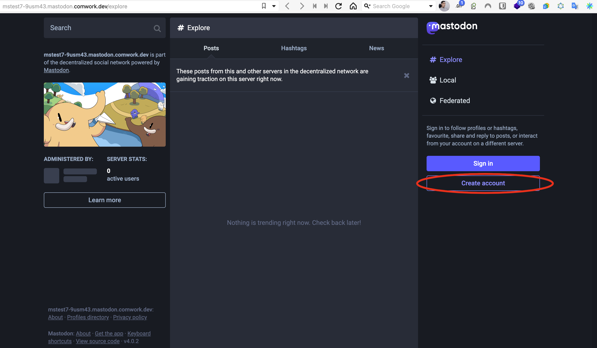

# Mastodon as a service

## Translations

This tutorial is also available in the following languages:
* [Français 🇫🇷](../translations/fr/tutorials/mastodon.md)

## Getting started

You've just setup your Mastodon instance and you've got this error on the frontpage serve by the `https://{your_instance_hash}.mastodon.comwork.(cloud|dev|info)`, that's pretty normal. 


It's because your instance is not ready yet, you have to follow those steps first:

**1/** Connect with [ssh](./ssh.md)

**2/** Execute the following command on the SSH session:

```shell
sudo su -
docker-compose -f docker-compose-mastodon.yml run --rm shell bundle exec rake secret
```

And add the following variable with the output in the ansible environment file (`env/{ instance_hash }.yml`):

```yaml
mastodon_secret_key: changeit
```

**3/** Execute the following command on the SSH session:

```shell
sudo su -
docker-compose -f docker-compose-mastodon.yml run --rm shell bundle exec rake mastodon:webpush:generate_vapid_key
```

And add the following variables with the output (pick only the values right to the `=` signs) in the ansible environment file (`env/{ instance_hash }.yml`):

```yaml
mastodon_vapid_private_key: changeit
mastodon_vapid_public_key: changeit
```

**4/** Also update this setting (replace `"true"` by `"false"`):

```yaml
pgsql_first_install: "false"
```

Push on the `main` branch of your gitlab repo.

**5/** Your instance is ready on `https://{your_instance_hash}.mastodon.comwork.(cloud|dev|info)`, go register your first user account there:



**6/** On the SSH session you've opened earlier, register your user as the admin of instance using our rake task like that:

```shell
sudo su -
docker-compose -f docker-compose-mastodon.yml run -e USERNAME=YOUR_USERNAME --rm shell bundle exec rake comwork:set_admin
```

Replace `YOUR_USERNAME` by the username you've chosen.

## Settings automation in a gitops way

We also provide this project: [mastodon-term-services](https://gitlab.comwork.io/oss/mastodon-term-services) in order to automatize in a gitops way the following settings:

* Term of services html page
* List of rules
* Ban list of not compliant instances

Feel free to fork-it and make your own rules and term of services.
