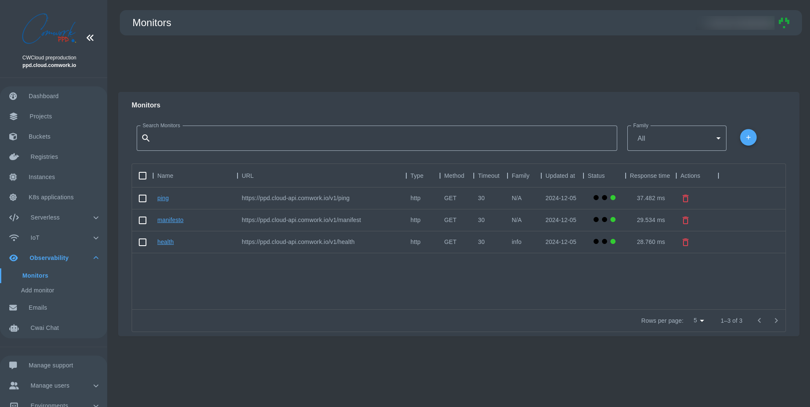

# Monitor Management System - User Guide

A monitor is a tool that helps you keep track of your web services health and performance. Think of it as a watchdog that regularly checks if your websites, APIs, or web services are working correctly. Each monitor periodically sends requests to a specified URL and reports back on:
- Whether the service is accessible
- How long it takes to respond
- If it's returning the expected results

## Why Do You Need Monitors?
- **Uptime Tracking**: Know immediately if your services go down
- **Performance Monitoring**: Track response times to identify slowdowns
- **Proactive Management**: Address issues before they affect your users
- **Service Level Agreement (SLA) Compliance**: Ensure your services meet agreed-upon availability standards

Here's a 10 min tutorial that will show you how to use our monitor management system:

## Viewing Your Monitors

1. Navigate to the Monitors page
2. You'll see a table showing all your current monitors with details like:
   - Monitor name
   - URL being monitored
   - Current status (Success/Failure/Pending)
   - Response time
   - Last update time

#### Managing Your Monitors
- **Search**: Use the search bar to filter monitors by name
- **Family Filter**: Use the dropdown to view monitors from a specific family
- **Add**: Click the "+" button in the top right corner to enter a new interface and create a new monitor
- **Delete**: Click the trash icon to remove a monitor
- **Edit**: Click on a monitor's name to modify its settings

#### Understanding Monitor Status
The status indicators show three colored dots:
- 🔴 Red: Failure - The monitor detected an issue
- 🟡 Yellow: Pending - Waiting for the next check
- 🟢 Green: Success - Everything is working correctly

## Creating a New Monitor: Detailed Configuration Guide

### Basic Configuration

#### 1. Request Method
Choose from three HTTP methods:
- **GET**: Retrieve information (default)
- **POST**: Submit data to be processed
- **PUT**: Update existing resources

#### 2. Monitor Name (Required)
- Provide a clear, descriptive name
- Helps quickly identify the specific service being monitored
- Example: "Production API Endpoint" or "User Registration Service"

#### 3. URL (Required)
- Full web address of the service to monitor
- Must be a valid, accessible endpoint
- Examples: 
  - `https://api.yourcompany.com/health`
  - `https://www.yourwebsite.com/login`

#### 4. Family (Optional)
- Group related monitors together
- Useful for organizing monitors by project, department, or service type
- Example: "Authentication Services", "Payment Gateways"

#### 5. Body (Optional)
- Appears when you choose the POST/PUT request method

#### 6. Owner (Required - admin only)
- Appears in the admin version of the interface
- You choose the owner of this monitor by email from the suggested options

### Advanced Configuration

#### Request Configuration
1. **Expected HTTP Code**
   - Default: `20*` (matches 200-209 range)
   - Customize to match your specific service's success response
   - Examples: 
     - `200`: Strict OK status
     - `20*`: Allows 200-209 range
     - `404`: For endpoints intentionally returning not found

2. **Expected Content**
   - Optional text the response must contain
   - Validates not just connectivity, but correct response
   - Examples:
     - `"success"`: Checks for specific text
     - JSON validation keywords
     - Health check confirmation messages

3. **Timeout**
   - How long (in seconds) to wait for a response
   - Default: 30 seconds
   - Adjust based on expected service response time
   - Shorter for critical, fast services
   - Longer for complex API calls

### Authentication Options

#### Basic Authentication
- **Username**: Optional login credential
- **Password**: Secure credential storage
- Show/hide password functionality included
- Supports various authentication scenarios:
  - Public APIs
  - Internal service endpoints
  - Protected resources

### Request Headers
- Add custom HTTP headers
- Useful for:
  - API key transmission
  - Content type specification
  - Custom authentication
  - Specific API requirements

#### Header Management
- **Add Header**: Click to introduce new custom headers
- **Edit Header**: Modify existing headers
- **Delete Header**: Remove unnecessary headers

### For Admin Users: Additional Owner Assignment
- Assign monitors to specific users
- Select user via email autocomplete
- Enables granular access and responsibility tracking

## Submission and Validation

### Before Creating a Monitor
Mandatory Fields:
- Monitor Name
- URL
- (For Admin) Owner/User Assignment

### Create Button
- Saves and activates the monitor
- Immediate validation of configuration
- Provides success/error toast notifications

## Best Practices and Recommendations

1. **Precision in Configuration**
   - Use exact URLs
   - Set realistic timeout values
   - Choose appropriate HTTP methods

2. **Security Considerations**
   - Use HTTPS endpoints
   - Rotate credentials regularly
   - Minimize exposed sensitive information

3. **Performance Monitoring**
   - Set up monitors for critical service paths
   - Use expected content checks for deeper validation
   - Group related services in families

4. **Maintenance**
   - Regularly review and update monitor configurations
   - Remove obsolete or redundant monitors
   - Adjust timeout and expectations as services evolve

## Troubleshooting

### Common Issues
- Incorrect URL
- Misconfigured authentication
- Overly strict timeout settings
- Mismatched expected HTTP codes

### Recommended Actions
1. Verify service accessibility
2. Check network configurations
3. Validate monitor settings
4. Consult system administrator for persistent issues

#### Best Practices
1. **Use Meaningful Names**: Choose descriptive names that help identify the service being monitored
2. **Group Related Monitors**: Use families to organize monitors for related services
3. **Set Appropriate Timeouts**: Configure timeouts based on your service's expected response time
4. **Regular Review**: Periodically review your monitors to ensure they're still relevant

### Getting Help
If you encounter any issues or need assistance:
1. Check if the monitor's configuration matches your service requirements
2. Verify the URL is accessible from your network
3. Contact support if you continue experiencing problems

Remember: A well-monitored system helps maintain high service quality and user satisfaction. Regular monitoring allows you to catch and fix issues before they impact your users.
