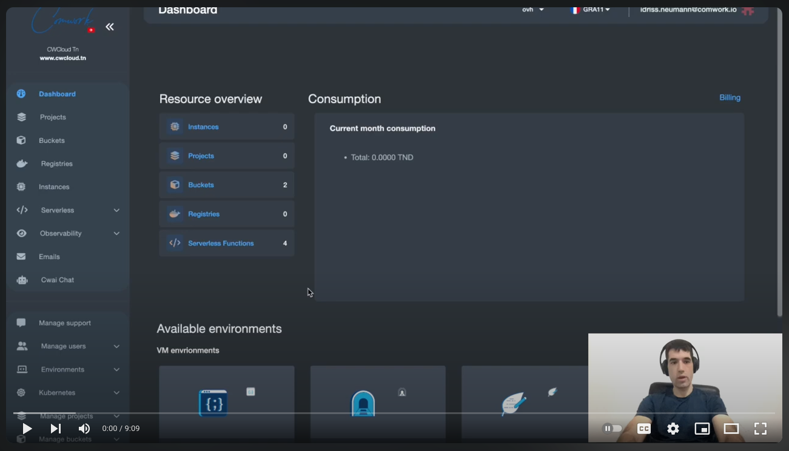
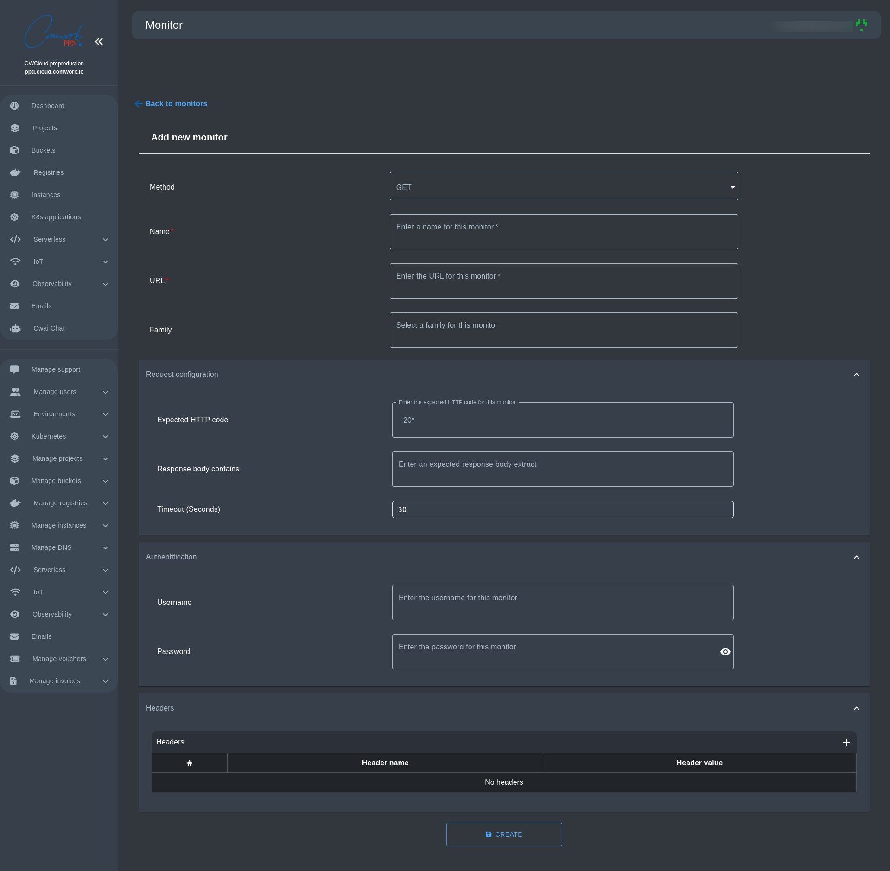

# Monitors

## Translations

This tutorial is also available in the following languages:
* [Français 🇫🇷](../../translations/fr/tutorials/observability/monitor.md)

## Purpose

A monitor is an external healthcheck which is performed on your application. For now we're implementing only http healthcheck with `GET`, `POST` and `PUT` methods. In the future we'll have more healthchecks.

Our monitor system is able to:
* present the last check in our graphical interface
* export the result as a Prometheus/OpenMetrics gauge in the `/v1/metrics` endpoint of CWCloud's API
* push the metrics to an opentelemetry OTLP/grpc endpoint (configured with the `OTEL_COLLECTOR_ENDPOINT` environment variables, see the [selfhosted documentation](../selfhosted/configuration/observability.md) for that).

## Demo

Here's a 10 min demo that will show you how to use our monitor management system:

## Creating a monitor

_Observability > Monitor_

Notes: 
* For the expected http code, you can use the `*` meta caracter which is evaluated as any number. For example if you set `20*`, the monitor will be "success" with every http code starting by `20` like `200`, `201`, `202`...
* The `response body contain` will make the monitor fail if the response body doesn't contain the value
* You can setup a basic authentication and custom headers
* For the `POST` and `PUT` methods you can configure the request's body
* You can also use the cli to create monitors, see [this documentation](../cli/public.md#monitors)

## Indexing Prometheus metrics into Quickwit

* In order to install Quickwit via CWCloud, go read [this tutorial](./quickwit.md)
* In order to configure Vector and Quickwit to scrap and index the Prometheus metrics, see [this blogpost](https://www.comwork.io/blog/quickwit-metrics)
