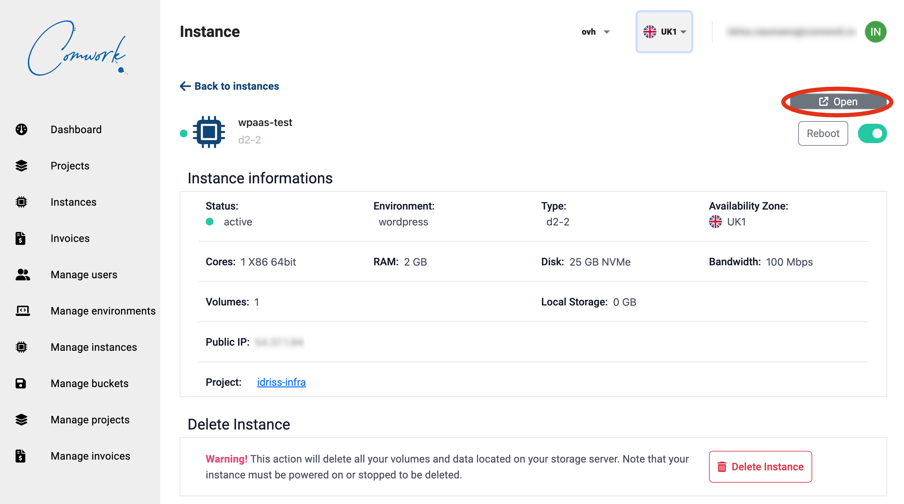

# Odoo

Once your instance is up, you can click on the `open` link here:

It'll ask for a username and password and Database Name:

* Database Name: `Add a Database Name`
* Email: `admin`
* Password: `admin`
