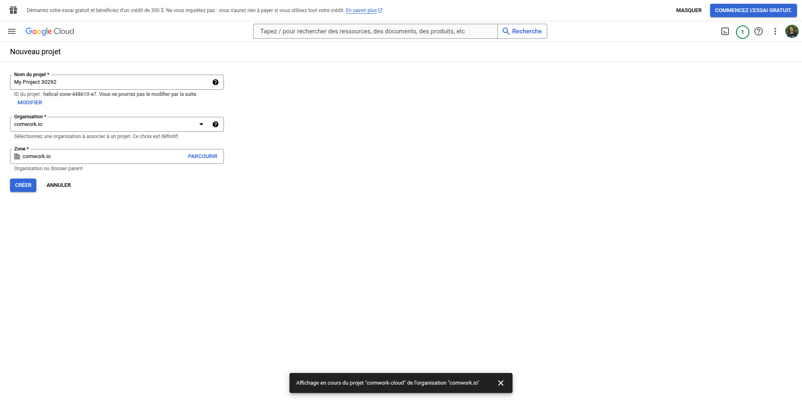
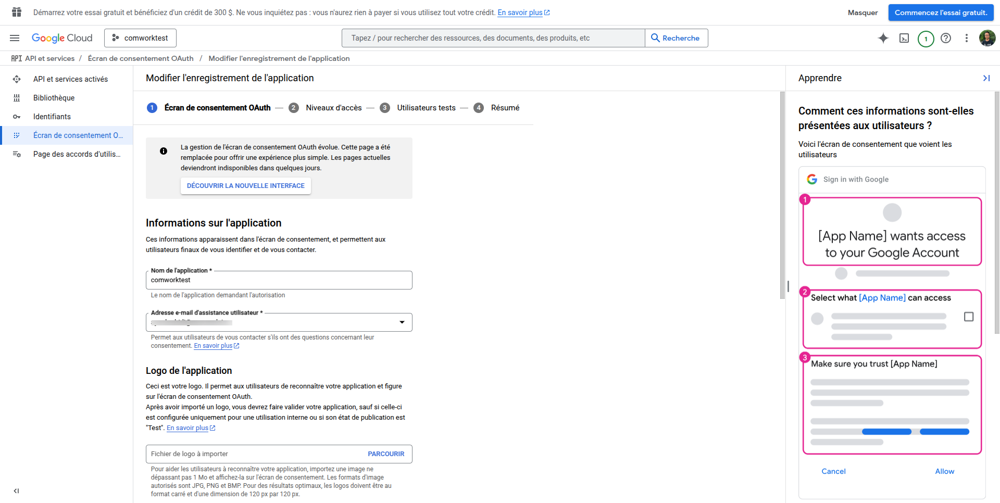
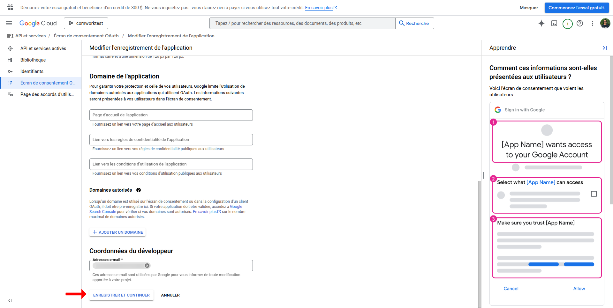
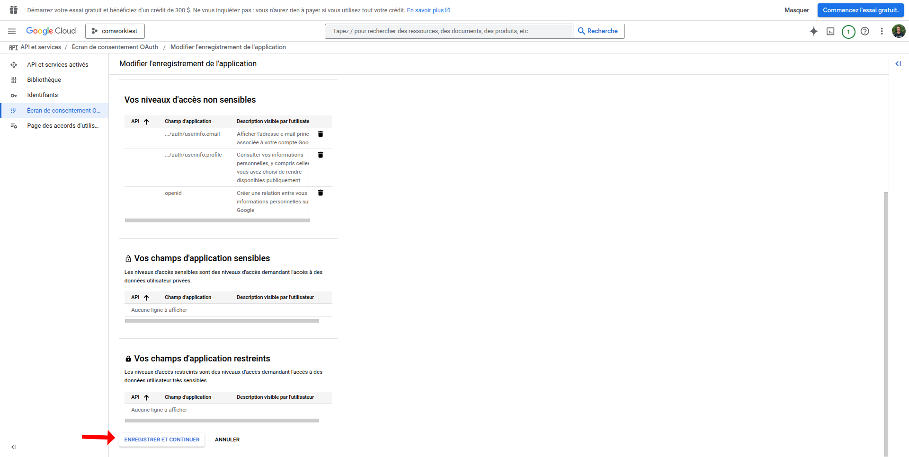
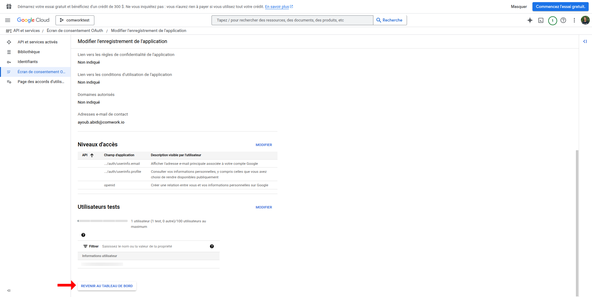
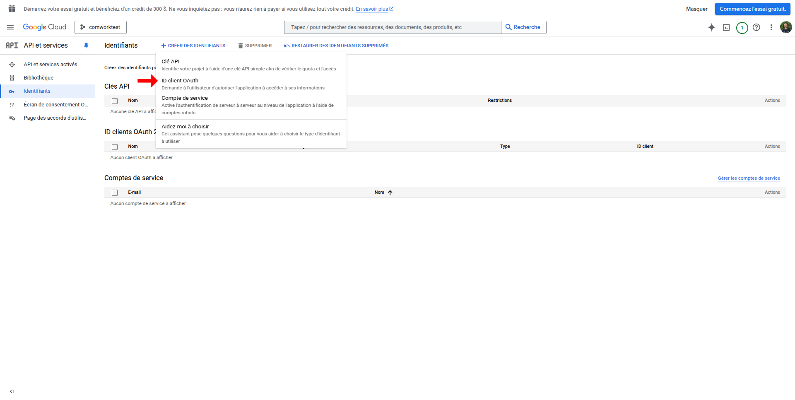
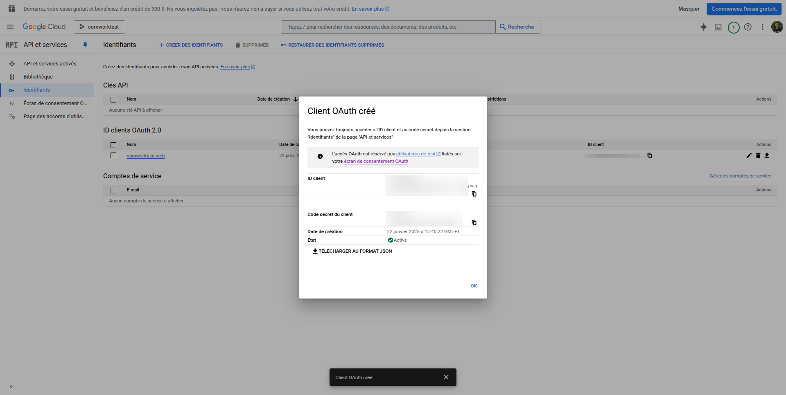

# OIDC configurations

## How to Get Google Client ID and Client Secret for Google OIDC configuration

1. Go to Google Cloud Console (https://console.cloud.google.com)

2. Create a new project or select an existing one
   - Click on the project dropdown at the top
   - Click "New Project" or select existing
   - If creating new, enter name and click "Create"

3. Enable OAuth consent screen
   - Go to "APIs & Services" > "OAuth consent screen"
   - Choose "External" user type
   - Fill required fields (app name, user support email, developer contact)
   - Under "OAuth consent screen", add test users if you're in test mode to make specific users able to user the newly added OIDC feature.
   - Add authorized domains including your platform's domain
   - Enable required Google APIs (like userinfo.email, userinfo.profile, and openid) if needed
   - Save and continue

4. Configure OAuth credentials
   - Go to "APIs & Services" > "Credentials"
   - Click "Create Credentials" > "OAuth client ID"
   - Select "Web application" as application type
   - Add name for the OAuth client
   - Add any additional authorized JavaScript origins and redirect URIs as needed
   - Click "Create"

5. Get credentials
   - After creation, you'll see the Client ID and Client Secret
   - Client Secret is shown only once, so store it safely

