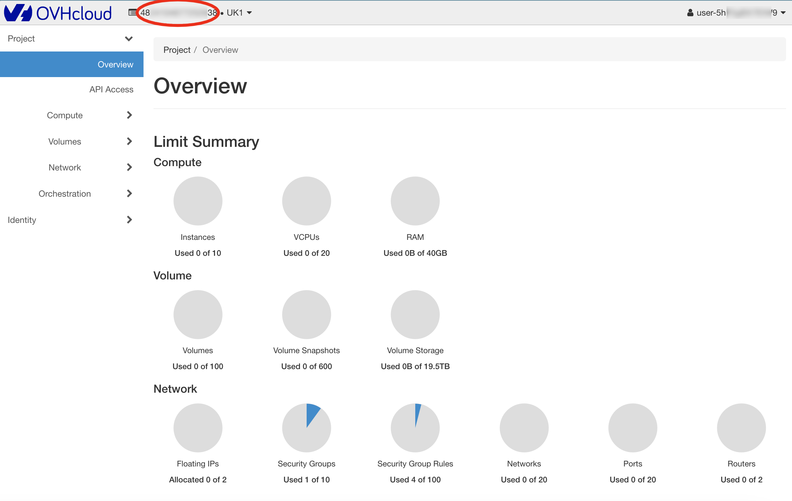
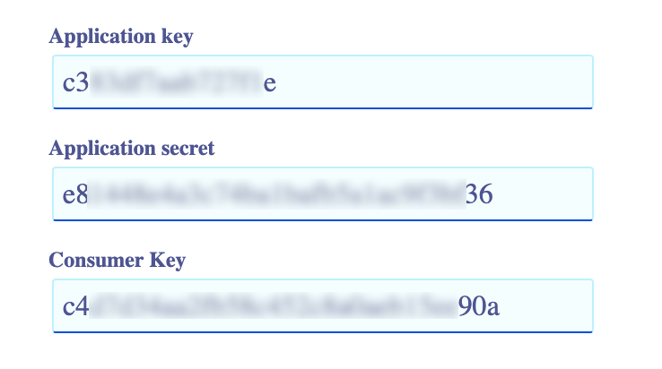

# Comwork cloud on premises

## Translations

This tutorial is also available in the following languages:
* [Français 🇫🇷](./translations/fr/onprem.md)

## Access to our images

In order to access to our images and releases, you'll need to ask first for beeing able to pull our OCI images.

You can do-it using:
* The [support system](./console/public/support.md)
* The `cloud@comwork.io` email
* Our [Slack workspace](https://join.slack.com/t/comwork-cloud/shared_invite/zt-1h04v2jp0-cF9p53MzfzxuChVobWKQEQ) (channel `#onpremise`)
* Our [Discord server](https://discord.gg/CXskxxPauz) (channel `#onpremise`)

## Using ansible

Here, you'll find an opensource ansible role to do it: https://gitlab.comwork.io/oss/ansible-iac/cloud

## Using docker-compose

Disclaimer: this example of configuration is working with OVHCloud only:

Here's an example of docker-compose file:

```yaml
version: '3.3'
services:
  comwork_cloud_ui:
    restart: always
    container_name: comwork_cloud_ui
    image: rg.fr-par.scw.cloud/comworkio/comwork_cloud_ui:main-79b0cf2e
    env_file: 
      - .env.webapp
    networks:
      - cloud_ui
    ports:
      - "80:80"

  comwork_cloud_api:
    restart: always
    container_name: comwork_cloud_api
    image: rg.fr-par.scw.cloud/comworkio/comwork_cloud_api:main-214f9bc5
    volumes:
      - cloud_environments.yml:/app/cloud_environments.yml:ro
    networks:
      - cloud_api
    env_file: 
      - .env.api
    ports:
      - "5000:5000"
  
  comwork_cloud_cache:
    image: redis:6.2.6
    restart: always
    container_name: comwork_cloud_cache
    networks:
      - cloud_api

  comwork_cloud_db:
    image: postgres:13
    container_name: comwork_cloud_db
    restart: always
    networks:
      - cloud_api
    env_file: 
      - .env.db
    # WARN: to enable to keep the postgresql data persistents
    # volumes:
    # - data_volume:/var/lib/postgresql/data

networks:
  cloud_api:
    driver: bridge
  cloud_ui:
    driver: bridge
```

And the `.env.db` file:

```shell
POSTGRES_USER=cloud
POSTGRES_PASSWORD=changeit
POSTGRES_DB=cloud
```

The `.env.webapp` file:

```shell
API_URL=https://cloud-api.yourdomain.com
API_VERSION=v1
VERSION=main-79b0cf2e
DOC_URL=https://doc.cloud.comwork.io
DISABLE_PAYMENT_FEATURE=True
# EXTERNAL_LOGO_URL=https://yourdomain.com/logo.png
MATOMO_URL=
MATOMO_SITE_ID=`
```

The `.env.api` file:

```shell
APP_ENV=prod
LOG_LEVEL=INFO
API_URL=https://cloud-api.yourdomain.com
COMPANY_NAME=Sobflous
PULUMI_ACCESS_TOKEN=pul-changeit
PULUMI_CONFIG_PASSPHRASE=changeit # base64
PULUMI_BACKEND_URL=s3://pulumi-tfstate?endpoint=changeit

SLACK_TOKEN=changeit
SLACK_TRIGGER=off
SLACK_CHANNEL=#cloud
SLACK_EMOJI=:comworkcloud:
SLACK_USERNAME=comwork-cloud

DYNAMIC_REPO_GROUPID=changeit # integer id
GIT_EMAIL=cloud@yourdomain.com
GIT_PLAYBOOK_REPO_URL=https://gitlab.yourdomain.com/infrastructure/infra-playbook.git
PLAYBOOK_REPO_PROJECTID=changeit
GITLAB_PROJECTID_ISSUES=changeit
GIT_PRIVATE_TOKEN=changeit
GIT_USERNAME=comwork_cloud
FLASK_ENV=production
SENDGRID_API_KEY=changeit
TOKEN_EXPIRATION_TIME=7200
JWT_SECRET_KEY=changeit # base64
POSTGRES_HOST_AUTH_METHOD=changeit
POSTGRES_PASSWORD=changeit
POSTGRES_HOST=comwork_cloud_db
POSTGRES_PORT=5432
POSTGRES_USER=cloud
POSTGRES_DB=cloud
REDIS_HOST=comwork_cloud_cache
AWS_ACCESS_KEY_ID=changeit
AWS_SECRET_ACCESS_KEY=changeit
AWS_DEFAULT_REGION=bhs
API_VERSION=v1
APP_VERSION=main-214f9bc5
GITLAB_URL=https://gitlab.yourdomain.com
EMAIL_EXPEDITOR=cloud@yourdomain.com

# Openstack ovh config
OS_AUTH_URL=https://auth.cloud.ovh.net/v3/
OS_DOMAIN_NAME=default
OS_USERNAME=user-changeit
OS_PASSWORD=changeit
OS_TENANT_NAME=changeit
DEFAULT_PROVIDER=ovh
# ovh config
OVH_ENDPOINT=changeit
OVH_APPLICATION_KEY=changeit
OVH_APPLICATION_SECRET=changeit
OVH_CONSUMER_KEY=changeit
OVH_SERVICENAME=changeit

# scaleway config
SCW_PROJECT_ID=changeit
SCW_SECRET_KEY=changeit
SCW_ACCESS_KEY=changeit

# Yubico for the 2FA
YUBICO_CLIENT_ID=changeit
YUBICO_SECRET_KEY=changit

PRICE_d2_2=""
PRICE_d2_4=""
PRICE_d2_8=""
PRICE_b2_15=""
```

The `cloud_environments.yml` file:

```yaml
name: cloud environments configuration
description: cloud environments configuration

providers: 
  - name: ovh
    strategy: OpenStackStrategy
    regions:
     - name: UK1 
       zones: ['nova']
     - name: DE1 
       zones: ['nova']
     - name: GRA11 
       zones: ['nova']
     - name: SBG5 
       zones: ['nova']
     - name: WAW1 
       zones: ['nova']
     - name: BHS5 
       zones: ['nova']
    instance_types: ['d2-2', 'd2-4', 'd2-8', 'b2-15']
    bucket_types: ['public-read', 'private']
    bucket_dns: '{bucket_name}.s3.{region}.perf.cloud.ovh.net'
    strategy: OpenStackStrategy
    instance_configs:
     - region: SBG5
       zones: &ovh_zones
         - name: nova
           instance_types:
           - type: d2-2
             core: 1 X86 64bit
             ram: 2 GB
             disk: 25 GB NVMe
             bandwidth: 100 Mbps
             localstorage: 0 GB
             price_variable: PRICE_d2_2
           - type: d2-4
             core: 2 X86 64bit
             ram: 4 GB
             disk: 50 GB NVMe
             bandwidth: 250 Mbps
             localstorage: 0 GB
             price_variable: PRICE_d2_4
           - type: d2-8
             core: 4 X86 64bit
             ram: 8 GB
             disk: 50 GB NVMe
             bandwidth: 500 Mbps
             localstorage: 0 GB
             price_variable: PRICE_d2_8
           - type: b2-15
             core: 4 X86 64bit
             ram: 15 GB
             disk: 100 GB NVMe
             bandwidth: 250 Mbps
             localstorage: 0 GB
             price_variable: PRICE_b2_15

     - region: GRA11
       zones: *ovh_zones
     - region: UK1
       zones: *ovh_zones
     - region: DE1
       zones: *ovh_zones
     - region: WAW1
       zones: *ovh_zones
     - region: BHS5
       zones: *ovh_zones

# If you're using scaleway DNS service, you can add zones here
dns_zones: []

images: 
   - UK1-nova: bbc039ad-1b1c-490c-9aef-a13ce802db5f
   - DE1-nova: 05181328-d576-455d-8111-47195374daf0
   - BHS5-nova: 7608ec06-8953-4a05-836e-190508fa6464
   - WAW1-nova: a700cbe9-799c-4fd9-9246-117433c744cf
   - GRA11-nova: e9e315cd-9760-4982-81ce-79c04cdb2810
   - SBG5-nova: d357b913-e2a6-4b7e-9dac-0acd0d4acf5b

environments: 
  - environment: code
    extra_subdomains: []
  - environment: faasd
    extra_subdomains: []
  - environment: lt
    extra_subdomains: ['*']
  - environment: pgsql
    extra_subdomains: ['imalive']
  - environment: mariadb
    extra_subdomains: ['imalive']
  - environment: portainer
    extra_subdomains: []
  - environment: wpaas
    extra_subdomains: []
  - environment: matomo
    extra_subdomains: []
  - environment: vps
    extra_subdomains: ['imalive']
  - environment: elasticstack
    extra_subdomains: ['api', 'imalive']
```

## Configure comwork cloud with OVH

In this section, we'll see how to generate the different API keys with OVH.

### Constant values

Those values are constants and are not supposed to change:

```shell
OVH_ENDPOINT="ovh-eu"
OS_AUTH_URL="https://auth.cloud.ovh.net/v3/"
```

### Create a public cloud project

Create a project if there's no one existing:


Copy the project's id's value in the folling variable:

```shell
OVH_SERVICENAME="d89XXXXXXXX"
```

### Create a public cloud user


Store the username and password in the following environment variables:

```shell
OS_USERNAME="user-5hXXXXXXX9"
OS_PASSWORD="tBXXXXXXXXXXXXXXXXXXXF5"
```

### OpenStack API

You can login in the OpenStack WebUI with the previous credentials: https://horizon.cloud.ovh.net/



You can fill the following variable with the red-underlined values (the "_tenant_"):

```shell
OS_TENANT_NAME="48XXXXXXXX38"
```

### CaCloud API

In order to create a token, go there: https://www.ovh.com/auth/api/createToken

Beware on the following details:

* We have to put `*` with all the HTTP methods (GET/PUT/POST/DELETE). Clicl on `+` if there's one http verb missing one by one.
* _Unlimited_ for the duration

As we can see on the following screenshot:


Once it's done, keep the following values:



And write them into those environment variables:

```shell
OVH_APPLICATION_KEY="c3XXXXXXXXXXe"
OVH_APPLICATION_SECRET="e8XXXXXXXXXXX36"
OVH_CONSUMER_KEY="c4XXXXXXXXXX90a"
```

### Create a DNS zone

We simply have to buy a new domain name which will be dynamically managed by comwork cloud and that its DNZ zones __must not be managed by another service or process__.


Once we created the firts instance which will host comwork cloud with a public IP, we'll have to add a DNS `A` record with this public IP, i.e: `cwcloud.xxxxx.com`.

## Console tutorials

You might use the console as an administrator if you're getting your own on premises instance.

You'll find all the tutorials you need for administrating the console [here](./console/admin/README.md)
