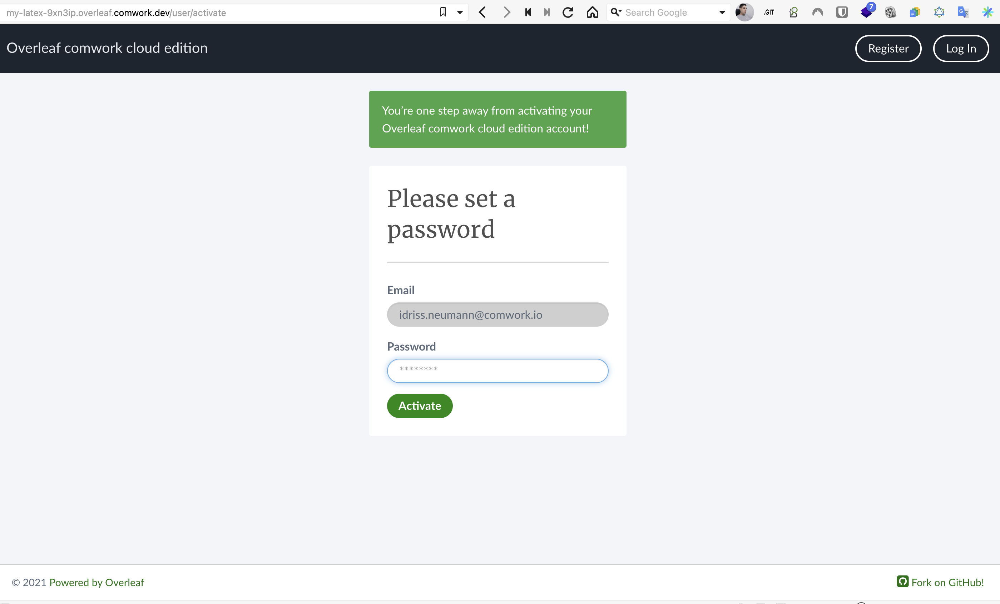

# Overleaf as a service

[Overleaf](https://www.overleaf.com) is an opensource online platform for generating document from LaTex input and work in a collaborative way similar to gitlab or github. Very suitable for a research and development team.

## Finish the installation

Once the creation of your overleaf's instance is finished:

* [connect with SSH](./ssh.md)
* Run this command:

```shell
$ docker exec sharelatex grunt user:create-admin --email=youremail@yourdomain.com
```

You'll have this output:

```shell
The grunt command is deprecated, run the create-user script using node instead
+ TASK=user:create-admin
+ shift 1
+ cd /overleaf/services/web
+ case "$TASK" in
+ echo 'The grunt command is deprecated, run the create-user script using node instead'
+ node modules/server-ce-scripts/scripts/create-user --admin --email=joe@comwork.io
Using default settings from /overleaf/services/web/config/settings.defaults.js
Using settings from /etc/sharelatex/settings.js
Set UV_THREADPOOL_SIZE=16
{"name":"default-sharelatex","hostname":"c23ac327af9a","pid":450,"level":40,"msg":"Email transport and/or parameters not defined. No emails will be sent.","time":"2022-10-19T16:56:29.446Z","v":0}
Done.

Successfully created joe@comwork.io as an admin user.

Please visit the following URL to set a password for joe@comwork.io and log in:

  http://localhost/user/activate?token=b5322ce7f53e333413d4f86bb4a381462c590ba5a161187edce62904bc90ceba&user_id=63502c3dd762a601c22dc390
```

Then you'll have to open the link printed in the output in your browser, replacing `http://localhost` by `https://{your_instance_hash}.overleaf.comwork.(cloud|dev|info)`.


Then it'll ask to set a password to this admin account:



Then you'll be able to login with the password you just set!
