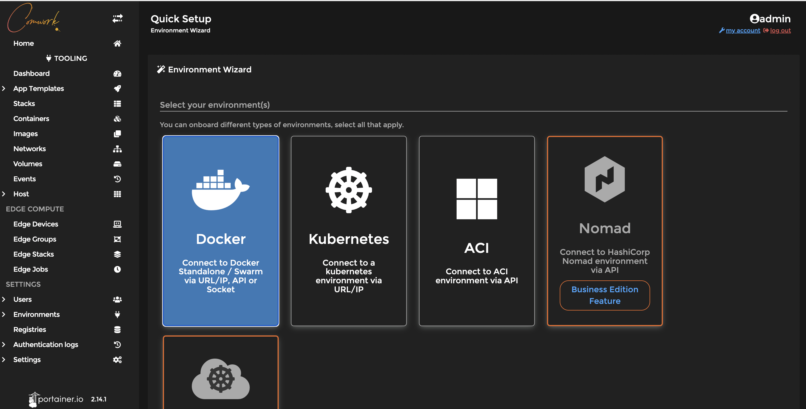
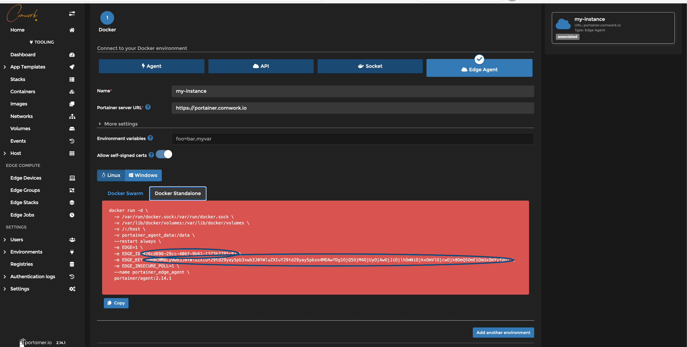

# Adding portainer agents on comwork cloud

4. You can install portainer edge agent this way:

1. Create "environment on your ansible role":



2. Keep the id and key values:



3. Install a [vps](../../vps.md)
4. Add our [ansible role](https://gitlab.comwork.io/oss/ansible-iac/portainer/ansible-portainer-agent) in the vps playbook
5. Change the following ansible variables with the previous key and id:

```yaml
portainer_agent_id: changeit
portainer_agent_key: changeit
```
