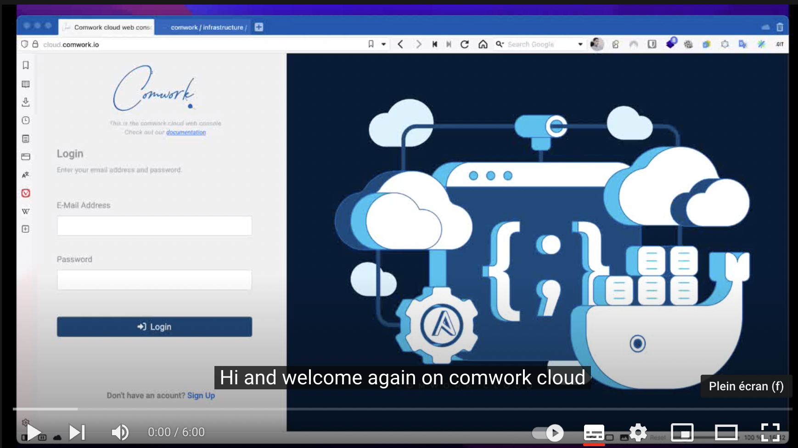

# Adding portainer agents on comwork cloud

1. You can install portainer edge agent this way:

2. Create "environment on your ansible role":


3. Keep the id and key values:


4. Install a [vps](../../vps.md)
5. Add our [ansible role](https://gitlab.comwork.io/oss/ansible-iac/portainer/ansible-portainer-agent) in the vps playbook
6. Change the following ansible variables with the previous key and id:

```yaml
portainer_agent_id: changeit
portainer_agent_key: changeit
```

We also got a demo video here:

[](https://youtu.be/iYK2cwHQh1A)

You can activate the subtitles in English or French to get more details on this demo.

Enjoy!
