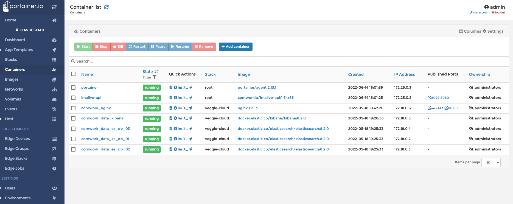
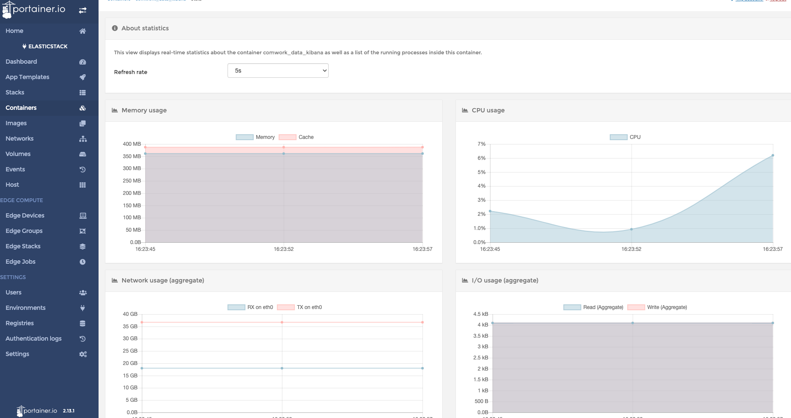
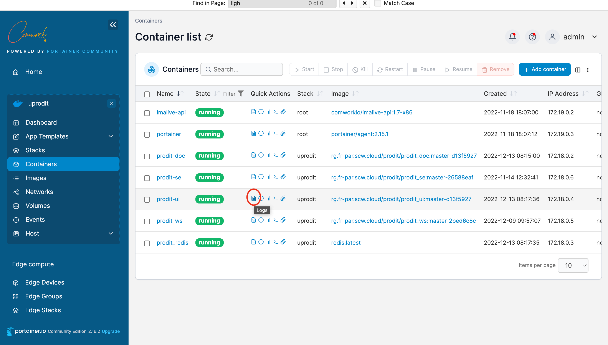
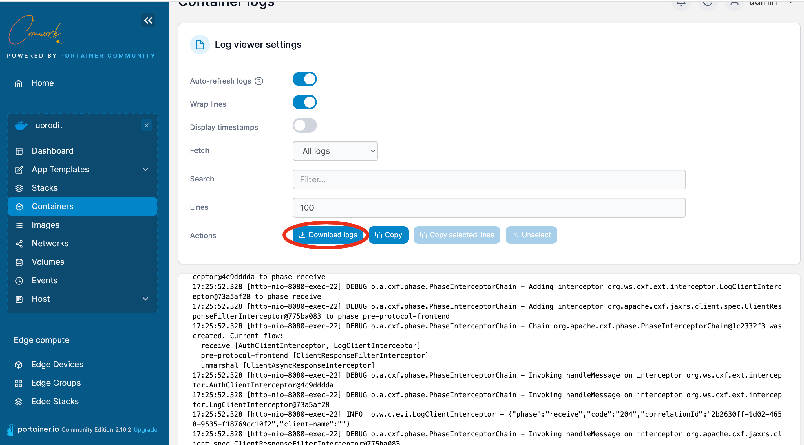
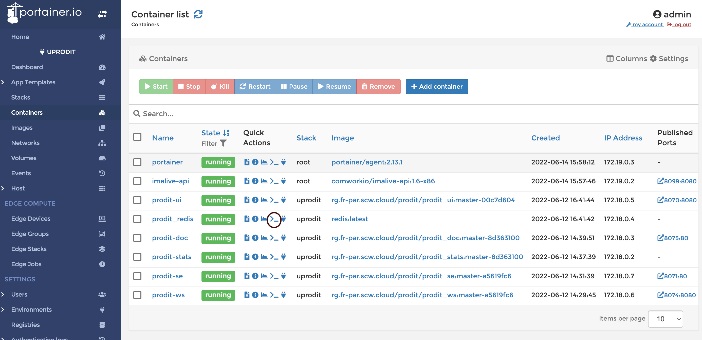
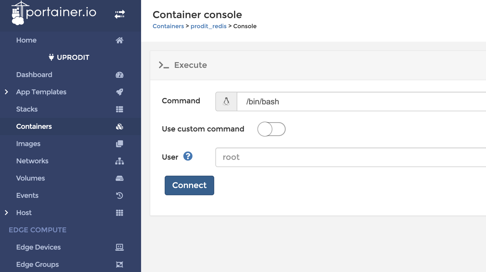
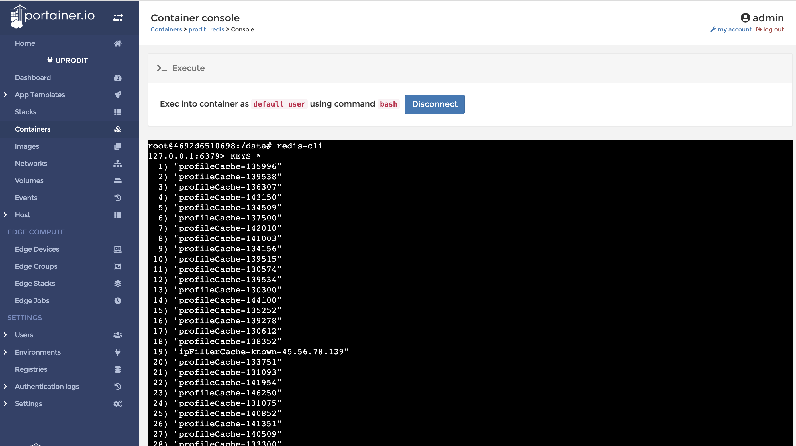

# Monitor and manage containers with portainer

You can manage all the containers that are deployed with docker (or kubernetes):

## Translations

This tutorial is also available in the following languages:
* [Français 🇫🇷](../translations/fr/portainer/containers.md)

## Monitor logs of containers

You can watch logs from containers clicking on this icon:

Then you can read the live logs and download them in order to be able to opening them in a more suitable editor to perform some research:

## Opening a shell inside a container

For example, connecting inside redis:

Choose the shell available inside your container (i.e: `#!/bin/bash` here):

The launch your commands (here we use `redis-cli` in order to monitor what's is stored in redis):

