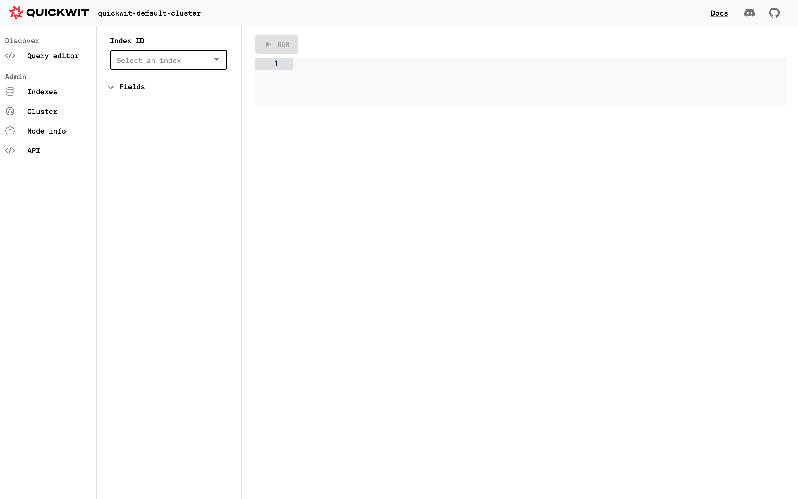

# Quickwit as a service

[Quickwit](https://www.quickwit.io) is a modern observability solution compliant with Grafana, Jaegger and OpenTelemetry.

For now it handles logs and traces with an efficiant search engine written in Rust (comparable to Apache Lucene used by Elasticsearch and Apache SolR) and it's able to store the data on object storage in order to lower the price.

## Translations

This tutorial is also available in the following languages:
* [Français 🇫🇷](../translations/fr/tutorials/quickwit.md)

## Installation and tests

Choose the Quickwit environment:


Once the installation is finished, test the access to Quickwit's GUI with this URL: `https://{your_instance_hash}.quickwit.comwork.(cloud|dev|info)`. The default credentials are:

* Username: `quickwit`
* Password: `changeit`



Then test with the same credentials, the Grafana's access with this URL: `https://grafana.{your_instance_hash}.quickwit.comwork.(cloud|dev|info)`


The default grafana credentials are:
* Username: `admin`
* Password: `admin`

Then, you'll be asked to change-it, don't forget to remember-it somewhere safe!

## Update your password

You can change your password in the `env/{env_name}.yml` file:

```yaml
gw_auth_files:
  - name: qw.keys
    users:
      - name: quickwit
        passwd: $apr1$M4x65b92$KsQCdoC.BzdBcuTai2MuG0
```

For generating a new password to copy in the `passwd` field:

```shell
htpasswd -c .htpasswd.tmp quickwit
cat .htpasswd.tmp | cut -d ":" -f2 # copy the output as passwd
rm -rf .htpasswd.tmp
```

## Grafana datasource for logs

Go back to Grafana: `https://grafana.{your_instance_hash}.quickwit.comwork.(cloud|dev|info)`

Add a new connection:


Then search "quickwit" and click on the right plugin:


Then click on "Add new datasource":


Then fill the form:


* URL: `http://quickwit:7280/api/v1`
* Index ID: `otel-logs-v0_7`

Then click on "Save and tests":


Then you'll be able to explore the data:


Then you'll be able to run some queries:


