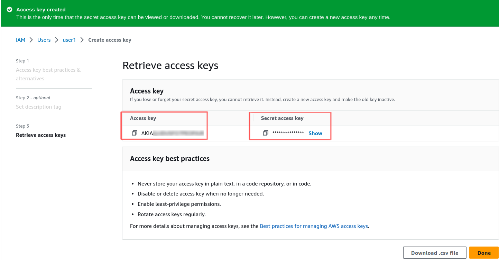
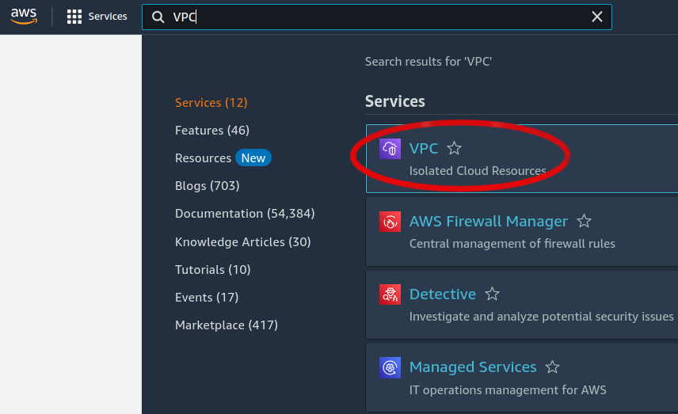

# Self-hosted CwCloud

## Translations

This tutorial is also available in the following languages:
* [Français 🇫🇷](../translations/fr/tutorials/selfhosted.md)

## Using ansible

Here, you'll find an opensource ansible role to do it: https://gitlab.comwork.io/oss/ansible-iac/cloud

## Using docker-compose

Disclaimer: this example of configuration is working with OVHCloud only:

Here's an example of docker-compose file:

```yaml
version: '3.3'
services:
  comwork_cloud_ui:
    restart: always
    container_name: comwork_cloud_ui
    image: rg.fr-par.scw.cloud/comworkio/comwork_cloud_ui:main-79b0cf2e
    env_file: 
      - .env.webapp
    networks:
      - cloud_ui
    ports:
      - "80:80"

  comwork_cloud_api:
    restart: always
    container_name: comwork_cloud_api
    image: rg.fr-par.scw.cloud/comworkio/comwork_cloud_api:main-214f9bc5
    volumes:
      - cloud_environments.yml:/app/cloud_environments.yml:ro
    networks:
      - cloud_api
    env_file: 
      - .env.api
    ports:
      - "5000:5000"
  
  comwork_cloud_cache:
    image: redis:6.2.6
    restart: always
    container_name: comwork_cloud_cache
    networks:
      - cloud_api

  comwork_cloud_db:
    image: postgres:13
    container_name: comwork_cloud_db
    restart: always
    networks:
      - cloud_api
    env_file: 
      - .env.db
    # WARN: to enable to keep the postgresql data persistents
    # volumes:
    # - data_volume:/var/lib/postgresql/data

networks:
  cloud_api:
    driver: bridge
  cloud_ui:
    driver: bridge
```

And the `.env.db` file:

```shell
POSTGRES_USER=cloud
POSTGRES_PASSWORD=changeit
POSTGRES_DB=cloud
```

The `.env.webapp` file:

```shell
API_URL=https://cloud-api.yourdomain.com
API_VERSION=v1
VERSION=main-79b0cf2e
DOC_URL=https://doc.cloud.comwork.io
DISABLE_PAYMENT_FEATURE=True
# EXTERNAL_LOGO_URL=https://yourdomain.com/logo.png
MATOMO_URL=
MATOMO_SITE_ID=`
```

The `.env.api` file:

```shell
APP_ENV=prod
LOG_LEVEL=INFO
API_URL=https://cloud-api.yourdomain.com
COMPANY_NAME=Sobflous
PULUMI_ACCESS_TOKEN=pul-changeit
PULUMI_CONFIG_PASSPHRASE=changeit # base64
PULUMI_BACKEND_URL=s3://pulumi-tfstate?endpoint=changeit

SLACK_TOKEN=changeit
SLACK_TRIGGER=off
SLACK_CHANNEL=#cloud
SLACK_EMOJI=:comworkcloud:
SLACK_USERNAME=comwork-cloud

DYNAMIC_REPO_GROUPID=changeit # integer id
GIT_EMAIL=cloud@yourdomain.com
GIT_PLAYBOOK_REPO_URL=https://gitlab.yourdomain.com/infrastructure/infra-playbook.git
PLAYBOOK_REPO_PROJECTID=changeit
GITLAB_PROJECTID_ISSUES=changeit
GIT_PRIVATE_TOKEN=changeit
GIT_USERNAME=comwork_cloud
SENDGRID_API_KEY=changeit
TOKEN_EXPIRATION_TIME=7200
JWT_SECRET_KEY=changeit # base64
POSTGRES_HOST_AUTH_METHOD=changeit
POSTGRES_PASSWORD=changeit
POSTGRES_HOST=comwork_cloud_db
POSTGRES_PORT=5432
POSTGRES_USER=cloud
POSTGRES_DB=cloud
REDIS_HOST=comwork_cloud_cache
AWS_ACCESS_KEY_ID=changeit
AWS_SECRET_ACCESS_KEY=changeit
AWS_DEFAULT_REGION=bhs
API_VERSION=v1
APP_VERSION=main-214f9bc5
GITLAB_URL=https://gitlab.yourdomain.com
EMAIL_EXPEDITOR=cloud@yourdomain.com

# Openstack ovh config
OS_AUTH_URL=https://auth.cloud.ovh.net/v3/
OS_DOMAIN_NAME=default
OS_USERNAME=user-changeit
OS_PASSWORD=changeit
OS_TENANT_NAME=changeit
DEFAULT_PROVIDER=ovh
# ovh config
OVH_ENDPOINT=changeit
OVH_APPLICATION_KEY=changeit
OVH_APPLICATION_SECRET=changeit
OVH_CONSUMER_KEY=changeit
OVH_SERVICENAME=changeit

# scaleway config
SCW_PROJECT_ID=changeit
SCW_SECRET_KEY=changeit
SCW_ACCESS_KEY=changeit

# Yubico for the 2FA
YUBICO_CLIENT_ID=changeit
YUBICO_SECRET_KEY=changit

PRICE_d2_2=""
PRICE_d2_4=""
PRICE_d2_8=""
PRICE_b2_15=""
```

The `cloud_environments.yml` file:

```yaml
name: cloud environments configuration
description: cloud environments configuration

providers: 
  - name: ovh
    strategy: OpenStackStrategy
    regions:
     - name: UK1 
       zones: ['nova']
     - name: DE1 
       zones: ['nova']
     - name: GRA11 
       zones: ['nova']
     - name: SBG5 
       zones: ['nova']
     - name: WAW1 
       zones: ['nova']
     - name: BHS5 
       zones: ['nova']
    instance_types: ['d2-2', 'd2-4', 'd2-8', 'b2-15']
    bucket_types: ['public-read', 'private']
    bucket_dns: '{bucket_name}.s3.{region}.perf.cloud.ovh.net'
    strategy: OpenStackStrategy
    instance_configs:
     - region: SBG5
       zones: &ovh_zones
         - name: nova
           instance_types:
           - type: d2-2
             core: 1 X86 64bit
             ram: 2 GB
             disk: 25 GB NVMe
             bandwidth: 100 Mbps
             localstorage: 0 GB
             price_variable: PRICE_d2_2
           - type: d2-4
             core: 2 X86 64bit
             ram: 4 GB
             disk: 50 GB NVMe
             bandwidth: 250 Mbps
             localstorage: 0 GB
             price_variable: PRICE_d2_4
           - type: d2-8
             core: 4 X86 64bit
             ram: 8 GB
             disk: 50 GB NVMe
             bandwidth: 500 Mbps
             localstorage: 0 GB
             price_variable: PRICE_d2_8
           - type: b2-15
             core: 4 X86 64bit
             ram: 15 GB
             disk: 100 GB NVMe
             bandwidth: 250 Mbps
             localstorage: 0 GB
             price_variable: PRICE_b2_15

     - region: GRA11
       zones: *ovh_zones
     - region: UK1
       zones: *ovh_zones
     - region: DE1
       zones: *ovh_zones
     - region: WAW1
       zones: *ovh_zones
     - region: BHS5
       zones: *ovh_zones

# If you're using scaleway DNS service, you can add zones here
dns_zones: []

images: 
   - UK1-nova: bbc039ad-1b1c-490c-9aef-a13ce802db5f
   - DE1-nova: 05181328-d576-455d-8111-47195374daf0
   - BHS5-nova: 7608ec06-8953-4a05-836e-190508fa6464
   - WAW1-nova: a700cbe9-799c-4fd9-9246-117433c744cf
   - GRA11-nova: e9e315cd-9760-4982-81ce-79c04cdb2810
   - SBG5-nova: d357b913-e2a6-4b7e-9dac-0acd0d4acf5b

environments: 
  - environment: code
    extra_subdomains: []
  - environment: faasd
    extra_subdomains: []
  - environment: lt
    extra_subdomains: ['*']
  - environment: pgsql
    extra_subdomains: ['imalive']
  - environment: mariadb
    extra_subdomains: ['imalive']
  - environment: portainer
    extra_subdomains: []
  - environment: wpaas
    extra_subdomains: []
  - environment: matomo
    extra_subdomains: []
  - environment: vps
    extra_subdomains: ['imalive']
  - environment: elasticstack
    extra_subdomains: ['api', 'imalive']
```

## Configure CwCloud with OVH

In this section, we'll see how to generate the different API keys with OVH.

### Constant values

Those values are constants and are not supposed to change:

```shell
OVH_ENDPOINT="ovh-eu"
OS_AUTH_URL="https://auth.cloud.ovh.net/v3/"
```

### Create a public cloud project

Create a project if there's no one existing:


Copy the project's id's value in the folling variable:

```shell
OVH_SERVICENAME="d89XXXXXXXX"
```

### Create a public cloud user


Store the username and password in the following environment variables:

```shell
OS_USERNAME="user-5hXXXXXXX9"
OS_PASSWORD="tBXXXXXXXXXXXXXXXXXXXF5"
```

### OpenStack API

You can login in the OpenStack WebUI with the previous credentials: https://horizon.cloud.ovh.net/


You can fill the following variable with the red-underlined values (the "_tenant_"):

```shell
OS_TENANT_NAME="48XXXXXXXX38"
```

### CaCloud API

In order to create a token, go there: https://www.ovh.com/auth/api/createToken

Beware on the following details:

* We have to put `*` with all the HTTP methods (GET/PUT/POST/DELETE). Click on `+` if there's one http verb missing one by one.
* _Unlimited_ for the duration

As we can see on the following screenshot:


Once it's done, keep the following values:


And write them into those environment variables:

```shell
OVH_APPLICATION_KEY="c3XXXXXXXXXXe"
OVH_APPLICATION_SECRET="e8XXXXXXXXXXX36"
OVH_CONSUMER_KEY="c4XXXXXXXXXX90a"
```

### Create a DNS zone

We simply have to buy a new domain name which will be dynamically managed by CwCloud and that its DNZ zones __must not be managed by another service or process__.


Once we created the first instance which will host CwCloud with a public IP, we'll have to add a DNS `A` record with this public IP, i.e: `cwcloud.xxxxx.com`.

### Golden images with packer and ansible

You'll have to create image that are container git and ansible to accelerate the deployments.

In order to achieve this, follow this repository: https://gitlab.comwork.io/oss/cwc/golden-images-ovh

## Configure CwCloud with AWS

In this section, we'll see how to generate access and secret keys with AWS. Then we will see how to get the subnet ID for each availability zone (a, b, c,...), the security group ID as well as the DNS hosted zone ID.

### Choose a region

On the right of the Console Home page, you can find a list of all activated regions in your account. Choose the closest region to where you're working:

You can write the region value in this environment variable:

```shell
AWS_STRATEGY_DEFAULT_REGION="xx-xxxx-x"
```


### Create a user

We first have to create a user from which we generate access and secret keys. Search for IAM:


Select Users: 


You will have a three step process to create the user:

1. Write user's name.

2. Set his permissions.


3. Then create.


### Create access and secret keys

Select the created user then:


We go down in the user page:


Choose the Command Line Interface option, then write a description (optional). Finally, create the key.


Then you can get the your access and secret key as well as the default region so that you can write them into those environment variables:

```shell
AWS_STRATEGY_ACCESS_KEY_ID="AKIxxxxxxxxxxxxxxxxx"
AWS_STRATEGY_SECRET_ACCESS_KEY="qvXXXXXXXXXXXXXXXXXXXXXXXXXXXXXXXX"
```



### Get subnet ID

Search for VPC:



Seleck the VPC you want to work with:


Select the wanted VPC. You can find the subnet ID for each availability zone (a, b, c, etc.)


You choose the subnet IDs accordingly to each availability zone. You can write the subnet ID in the cloud environments yaml file: 

```shell
zones:
  - name: "availability_zone"
    subnet: subnet-048XXXXXXXXXXXXXX
```

### Get security group ID

In the left side-bar, choose Security Groups: 


You choose the subnet IDs accordingly to each region and availability zone(a, b, c). You can write the security group ID in the cloud environments yaml file: 

```shell
zones:
  - name: "availability_zone"
    subnet: sg-026XXXXXXXXXXXXXX
    sg: sg-0266XXXXXXXXXXXXX
```


### Get the DNS hosted zone ID

Search for Route53:


You should buy a Domain so that you can get a Hosted Zone automatically.


You can write the hosted zone ID in the cloud environments yaml file:

```shell
dns_hosted_zone_id: Z08XXXXXXXXXXXXXXXXB
```


## Console tutorials

You might use the console as an administrator if you're getting your own on premises instance.

You'll find all the tutorials you need for administrating the console [here](./console/admin/README.md)

## Observability

Cwcloud-api is providing a `/metrics` http endpoint that can be scrapped by Prometheus:


And can also send the metrics and some traces through OTLP/Grpc (configured with the `OTEL_COLLECTOR_ENDPOINT` environment variable). 

Here's example of traces with Jaegger:


