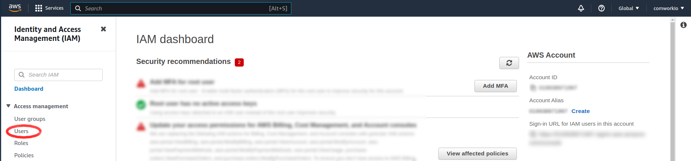
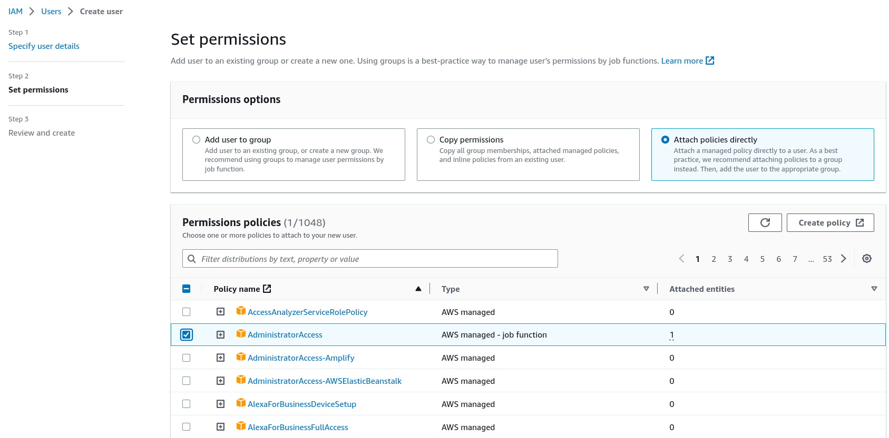
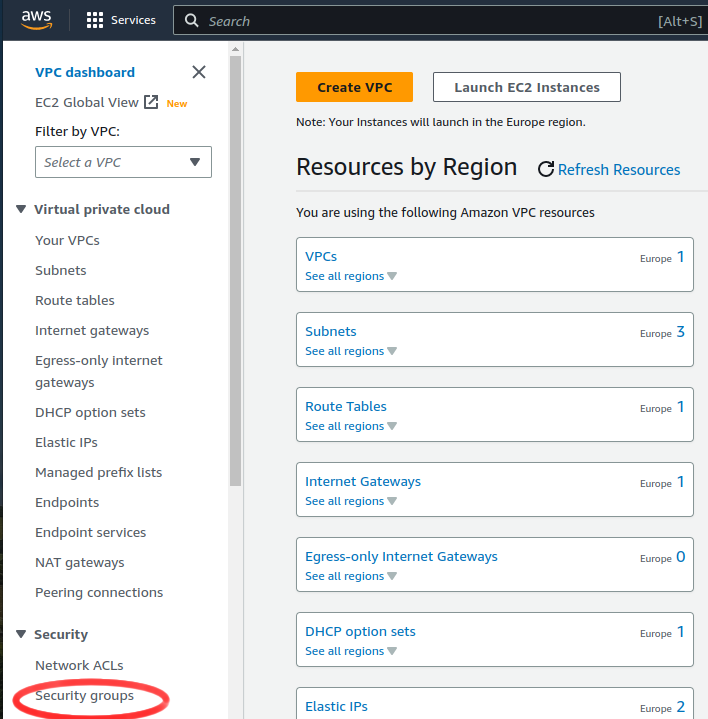

# Configuring AWS

In this tutorial, we'll see how to generate access and secret keys with AWS. Then we will see how to get the subnet ID for each availability zone (`a`, `b`, `c`...), the security group ID as well as the DNS hosted zone ID.

## Translations

This tutorial is also available in the following languages:
* [Français 🇫🇷](../../../translations/fr/tutorials/selfhosted/configuration/aws.md)

## Configuration

### Choosing a region

On the right of the Console Home page, you can find a list of all activated regions in your account. Choose the closest region to where you're working:

You can write the region value in this environment variable:

```shell
AWS_STRATEGY_DEFAULT_REGION="xx-xxxx-x"
```


### Create a user

We first have to create a user from which we generate access and secret keys. Search for IAM:


Select Users: 




You will have a three step process to create the user:

1. Write user's name.

2. Set his permissions.



3. Then create.


### Create access and secret keys

Select the created user then:


We go down in the user page:


Choose the Command Line Interface option, then write a description (optional). Finally, create the key.


Then you can get the your access and secret key as well as the default region so that you can write them into those environment variables:

```shell
AWS_STRATEGY_ACCESS_KEY_ID="AKIxxxxxxxxxxxxxxxxx"
AWS_STRATEGY_SECRET_ACCESS_KEY="qvXXXXXXXXXXXXXXXXXXXXXXXXXXXXXXXX"
```


### Get subnet ID

Search for VPC:


Seleck the VPC you want to work with:


Select the wanted VPC. You can find the subnet ID for each availability zone (a, b, c, etc.)


You choose the subnet IDs accordingly to each availability zone. You can write the subnet ID in the cloud environments yaml file: 

```shell
zones:
  - name: "availability_zone"
    subnet: subnet-048XXXXXXXXXXXXXX
```

### Get security group ID

In the left side-bar, choose Security Groups: 



You choose the subnet IDs accordingly to each region and availability zone(a, b, c). You can write the security group ID in the cloud environments yaml file: 

```shell
zones:
  - name: "availability_zone"
    subnet: sg-026XXXXXXXXXXXXXX
    sg: sg-0266XXXXXXXXXXXXX
```


### Get the DNS hosted zone ID

Search for Route53:


You should buy a Domain so that you can get a Hosted Zone automatically.


You can write the hosted zone ID in the cloud environments yaml file:

```shell
dns_hosted_zone_id: Z08XXXXXXXXXXXXXXXXB
```


