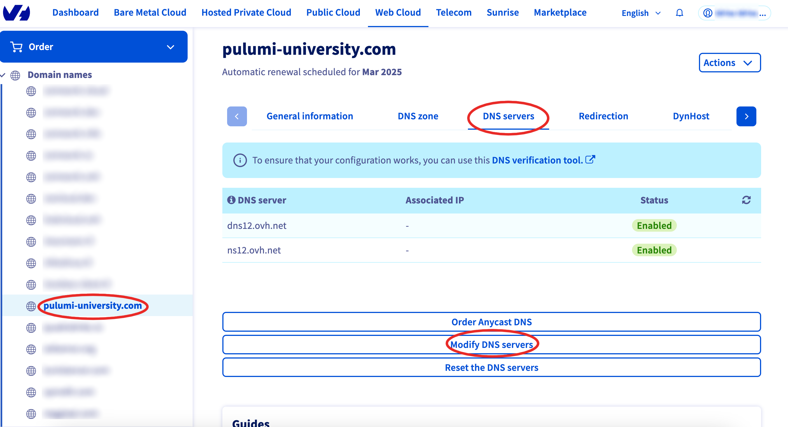
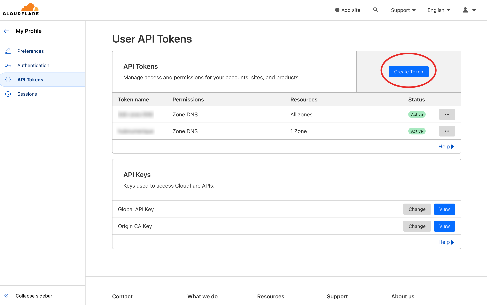
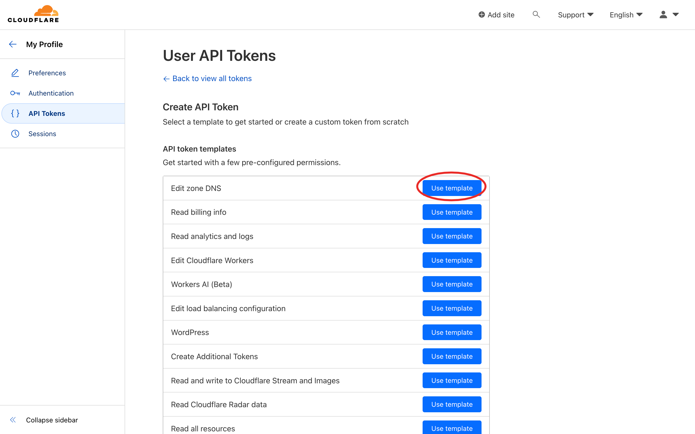
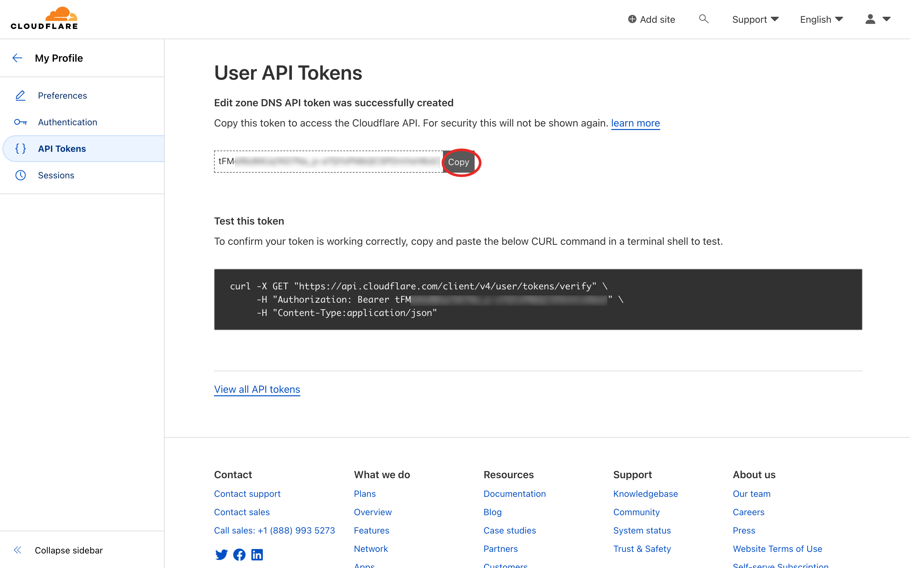
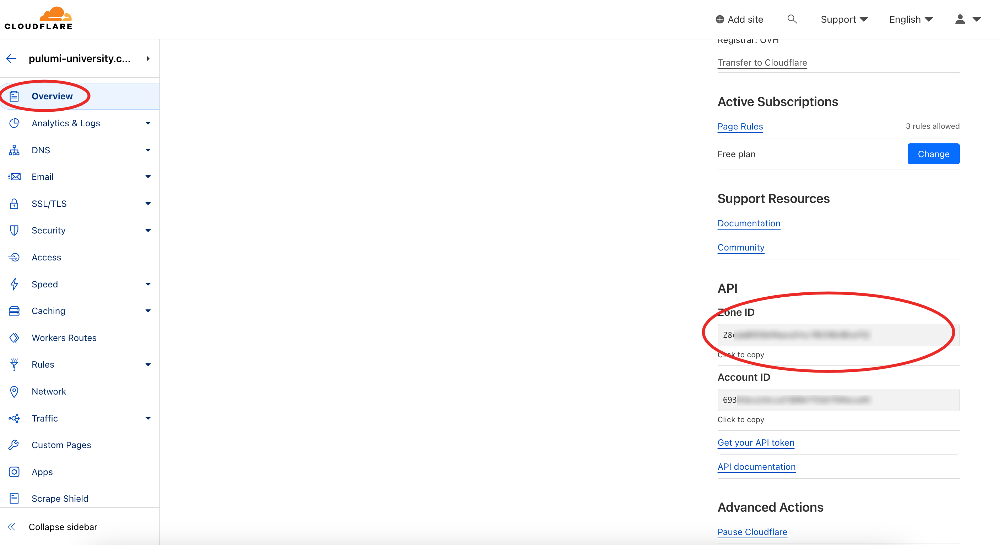

# Configuring cloudflare

## Translations

This tutorial is also available in the following languages:
* [Français 🇫🇷](../../../translations/fr/tutorials/selfhosted/configuration/cloudflare.md)

## Configuration

1. Add a new site on cloudflare console:


2. Register your domain name with the Free Plan, then copy the DNS servers:


3. Update the DNS server of your domain name, example with OVH:



Replace here the servers `dns12.ovh.net` and `ns12.ovh.net` by the cloudflare's you copied before.

Wait a little bit (it might took 24h), the DNS servers should appears up to date like this:


4. Go create an API token for your selfhosted cwcloud instance:


Then:



Then choose the right template:



Then choose the DNS zone:


Then you can copy/paste the generated token:



You'll have to set the `CLOUDFLARE_API_TOKEN` environment variable with this token.

1. You can add the DNS zone in the `cloud_environments.yml` file:

```yaml
dns_zones:
  - name: pulumi-university.com
    driver: CloudflareDriver
    zone_id: XXXXXXX
```

In order to get the `zone_id`, you can go on cloudflare and copy/past the following value:


