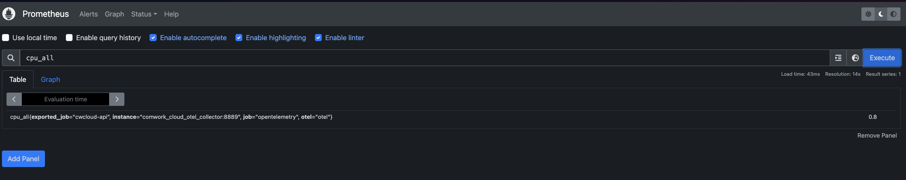

# Observability configuration

## Translations

This tutorial is also available in the following languages:
* [Français 🇫🇷](../../../translations/fr/tutorials/selfhosted/configuration/observability.md)

## Configuration

Cwcloud-api is providing a `/metrics` http endpoint that can be scrapped by Prometheus:

And you can also send the metrics, logs and some traces through OTLP/Grpc (configured with the `OTEL_COLLECTOR_ENDPOINT` environment variable).

Here's example of traces with Jaegger:

