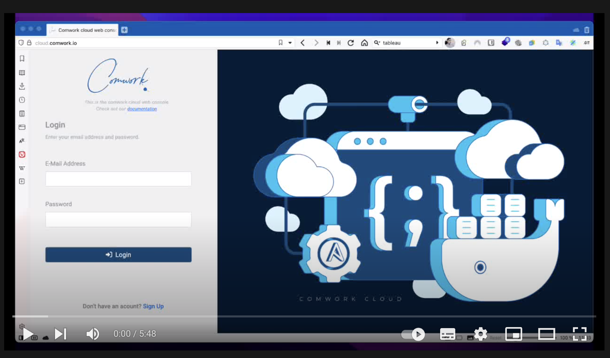

# Lancer et exposer un pod avec k3d

## Traductions

Ce tutoriel est également disponible dans les langues suivantes :
* [English 🇬🇧](../../../code/k3d.md)

## Démo

Vous trouverez une démo sur comment démarrer un pod sur votre instance de [code](../../../../code.md) avec `k3d` (distribution Kubernetes K3S qui tourne au dessus de docker) et comment l'exposer avec une adresse publique grâce à localtunnel (`lt`).

Vous pouvez activer les sous-titres en Anglais ou en Français pour avoir les explications en live.

Remarque : vous pouvez utiliser une instance dédiée de localtunnel dans comwork cloud. Pour plus d'informations, [rendez-vous ici](../../../../localtunnel.md).
