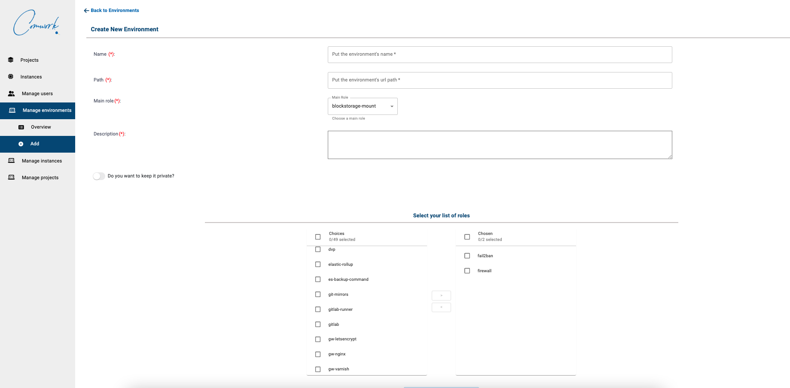

# Gérer les environments

Vous pouvez gérer les environnements qui sont des collections de rôles et templates ansibles.


Garder un environnement en "privé" ne le rendra pas accessible aux utilisateurs qui ne sont pas administrateurs.



Attention à l'ordre des rôles:
* `common`, `sudo`, `ssh` doivent toujours être mis en premiers
* `gitlab-runner` doit être le dernier

If the `playbook-xxxx.yml` isn't in the right order, then you have to re-order all the roles one by one using the screen above.

Vous devrez probablement compléter le template jinja `comwork-cloud-api/ansible/env/instance_name.yml.j2` pour ajouter les variables obligatoires de votre environnement.

Si vous avez besoin de laisser des instructions sur les valeurs à changer dans ce fichier aux utilisateurs, vous avez également un template de documentation `comwork-cloud-api/ansible/env/instance_name.md.j2` à compléter.

Vous devez aussi compléter l'inventaire des images `/Users/ineumann/comwork-cloud-api/cloud_environments.yml` pour ajouter votre environnement et les images (packer) optimisées pour ce dernier:

```yaml
- environment: YOUR_ENVIRONMENT
  extra_subdomains: []
  images:
    - fr-par-1: 874c09fa-15e6-45eb-af3a-013f3318d220
    - fr-par-2: c0180f91-1ea8-4ee0-8df7-47183b8c36fc
    - nl-ams-1: 7afea3b7-d6cc-46b1-a1d9-8e60eba2c982
    - pl-waw-1: 296d036c-c0cd-478e-aad1-551d5ab95ede
```

Vous pouvez ré-utiliser les mêmes références que pour les environnements `code` ou `portainer` dans la plupart des cas.

Ensuite, si vous devez debugger les erreurs ansibles pour la première fois:
* Créer une VM simple (avec l'OS Almalinux ou CentOS dans sa dernière version)
* Cloner le repo gitlab de votre projet
* Lancer le playbook manuellement et debugger/corriger les erreurs au fur et à mesure:

```shell
dnf update -y
dnf install -y git epel-release
dnf install -y ansible
git clone https://gitlab.comwork.io/comwork/infrastructure/dynamic/YOUR_PROJECT.git
cd YOUR_PROJECT
./install.sh -e instance-YOUR_INSTANCE -p
```

Vous pourrez recréer ensuite l'environnement avec le rôle corrigé et ré-essayer à nouveau.
N'oubliez pas de supprimmer vos instances de debug.
