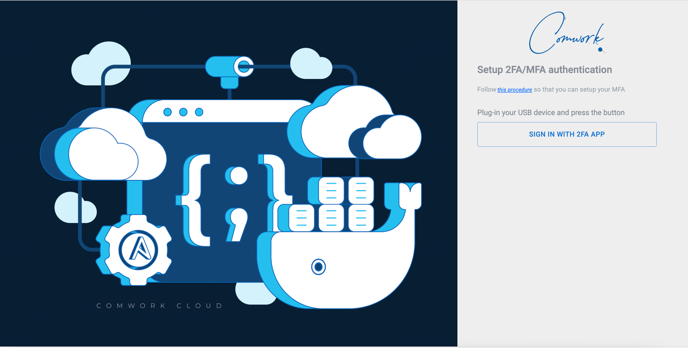

# 2FA / MFA

Nous recommandons **fortement** d'activer l'authentification double-facteurs (ou multiple-facteurs, a.k.a 2FA ou MFA).

## Avec une application 2FA (ex: Google Authenticator)

Allez dans vos paramètres:

Ensuite:

Vous pouvez enregistrer un device otp avec une application 2FA capable de scanner les QR codes comme [Google authenticator](https://play.google.com/store/apps/details?id=com.google.android.apps.authenticator2) qui est disponible pour Android et IOS/IpadOS.

Flashez le QR code avec cette application (ou une autre si vous préférez) et enregistrez le code otp affiché.

Vous aurez ensuite à écrire les 6 chiffres affichez par cette application à chaque fois que vous vous connecterez:

## Avec un périphérique USB

Pour l'instant nous fonctionnons qu'avec la marque [Yubico](https://www.yubico.com).

Allez dans vos paramètres:

Vous arriverez ensuite sur cette page:

Appuyez sur le bouton du périphérique, cela devrait fonctionner.
