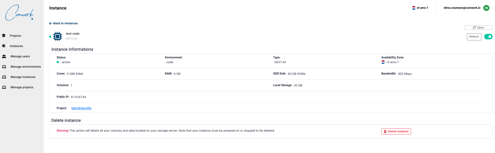

# Instances

La console est ici: https://cloud.comwork.io

Tout d'abord vous devez vous [inscrire](../../../../../subscription.md) si ce n'est pas le cas,  ensuite vous serez en mesure de créer des projets gitlab:

Ensuite pour créer des instances:

Après la création d'instances, vous pourrez les gérer depuis la console web:

