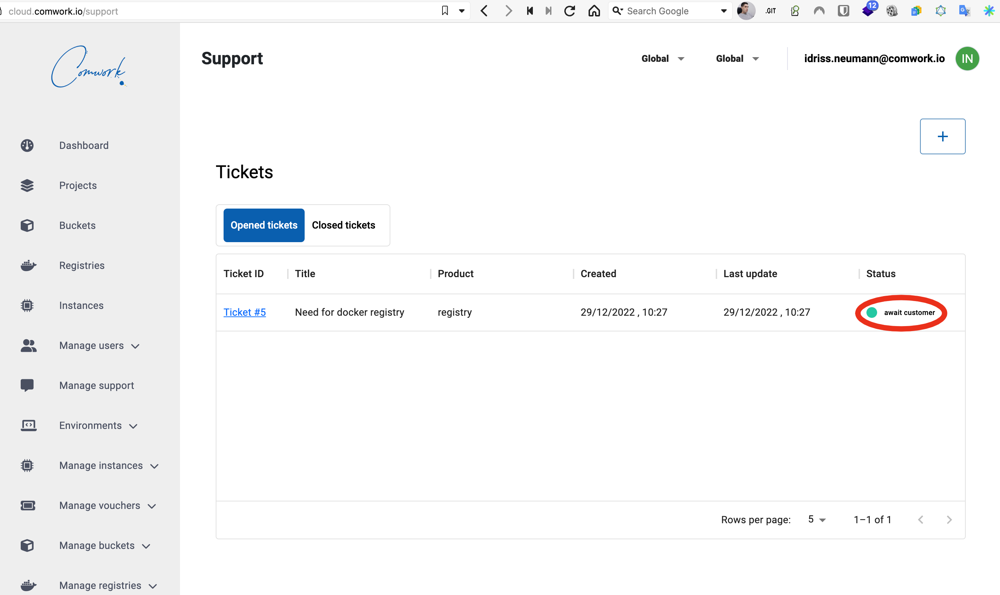

# Support

## Ouvrir un ticket

Cliquez sur "support" sur le menu utilisateur:

Ensuite vous aurez la possibilité d'ouvrir un nouveau ticket pour votre demande:

Vous devez choisir un produit qui correspond le plus à votre requête (dans cet exemple c'est "registry" mais cela pourrait être "wordpress" ou n'importe quoi d'autre). Vous devez choisir la "sévérité" en fonction de l'urgence de votre demande.

Faites attention à n'ouvrir **qu'un seul ticket par question ou incident**.

Une fois que c'est ouvert, vous pouvez vérifier régulièrement si l'équipe vous a répondu avec une demande de complément d'information (status "attente client" ou "await customer" dans la version anglaise).

Quand c'est le cas, répondez à la question comme ceci:

Et finalement quand c'est résolu, vous pourrez retrouver les demandes passées dans cet onglet:

## Autres moyens de contact

Nous vous recommandons **fortement** de toujours ouvrir des tickets pour un suivi plus efficace.

Une fois ouvert, vous pouvez également nous contacter en fournissant la référence du ticket via ces moyens:

* L'email `cloud@comwork.io`
* Notre [workspace Slack](https://join.slack.com/t/comwork-cloud/shared_invite/zt-1h04v2jp0-cF9p53MzfzxuChVobWKQEQ) (salon `#support`)
* Notre [serveur Discord](https://discord.gg/CXskxxPauz) (salon `#support`)
