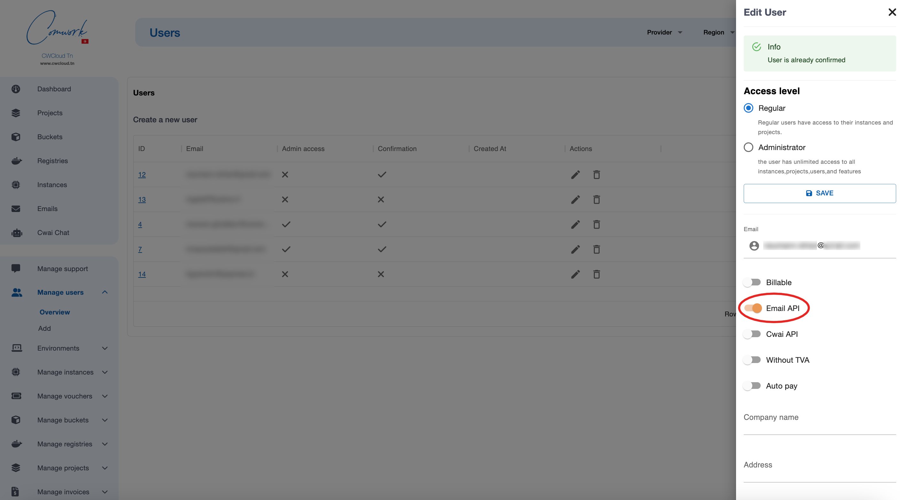
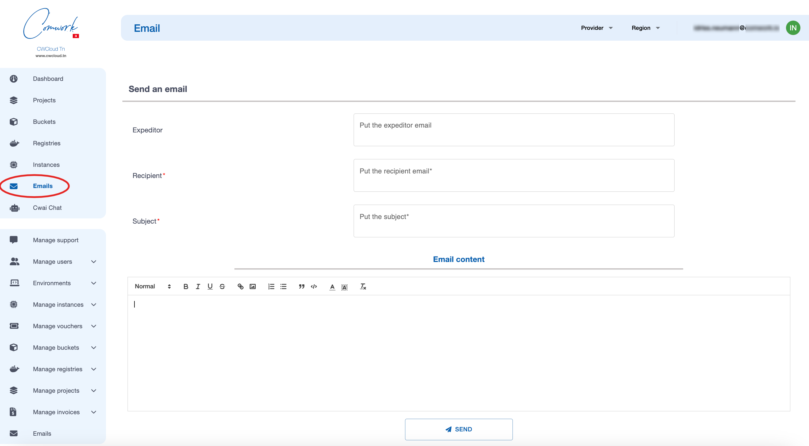
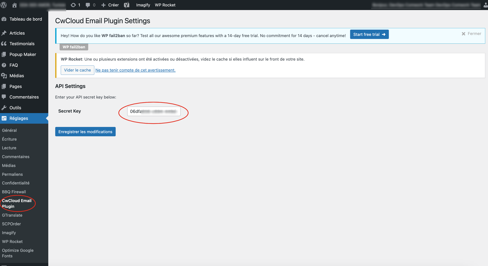

# Email API

## Traductions

Ce tutoriel est également disponible dans les langues suivantes :
* [English 🇬🇧](../../emailapi.md)

## Activer cette API

Dans la version SaaS, vous pouvez demander d'accéder à cette API en utilisant le [système de support](./console/public/support.md).

Si vous êtes administrateur de cette instance, vous pouvez autoriser les utilisateurs comme ceci :

## Formulaire

Une fois que vous êtes activé, vous pouvez utiliser l'API au travers de cette interface :

## Plugins pour CMS

### Plugin pour wordpress

Vous pouvez télécharger ce [plugin](https://gitlab.comwork.io/oss/cwc/cwcloud-wordpress-email):

**1/** Télécharger la bonne extension (soit la `-io` si vous utilisez l'instance [cloud.comwork.io](https://cloud.comwork.io), soit la `-tn` si vous utilisez l'instance [cwcloud.tn](https://www.cwcloud.tn))

**2/** Congigurer l'extension :

Générer des clefs d'API. Vous pouvez aller voir [ce tutoriel](./api/api_credentials.md)

Ensuite copier/coller la clef secrète ici :

