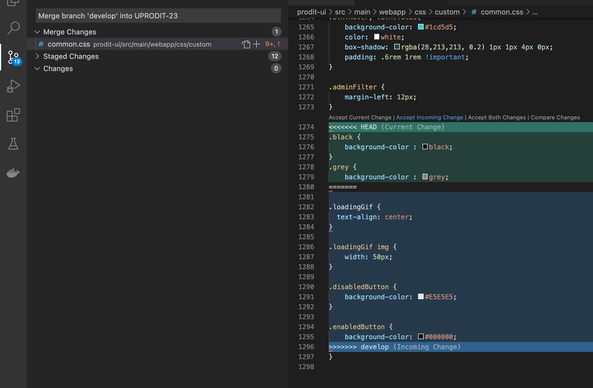
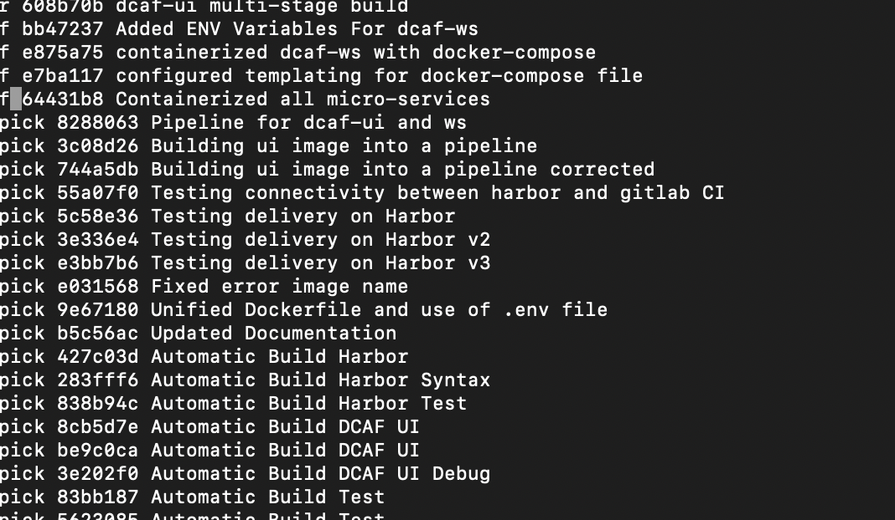
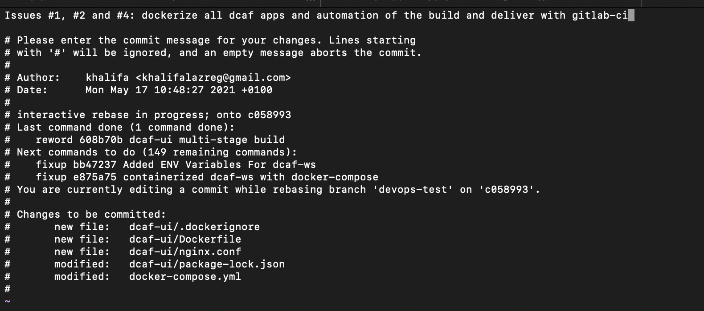

# Utilisation de git

## A propos

Ce tutoriel est ici de ce [workshop git](https://gitlab.comwork.io/comwork_public/training/git) ou vous trouverez également des slides et une partie pratique.

## Cloner un repo

```shell
git clone <url du repository>
```

## Création d'une branche

Toutes les branches doivent partir de `main` (autrefois `master` mais vous pouvez appeler votre branche par défaut protégée comme vous voulez, dans ce tutoriel on va rester sur `main`). 

Idéalement on peut pusher la branche cela permet de visualiser sur GitLab qu'elle a bien été créée à partir de `main` et qu'à sa création elle est à jour avec `main`.

```shell
git pull --rebase origin main
git checkout -b <numéro du ticket correspondante>
git push origin <numéro du ticket correspondante>
```

## Mise à jour d'une branche

Pour mettre à jour une branche il est préférable d'utiliser le rebase

```shell
git pull --rebase origin <numéro du ticket>
```

## Commit et push sur une branche

Il est important de le faire régulièrement et ne pas attendre d'avoir trop de modifications pour le faire.

Attention : le commit ne répercute pas les modifications sur le serveur GIT distant, c'est l'opération du push qui le fait.

```shell
git add . # à la racine du repo
git commit -m "<numéro de la branche ou ticket> commentaire"
git push origin <numéro de la branche ou ticket>
```

## Renommer une branche

Vous vous êtes trompé de nom ? Pas de panique.

```shell
git checkout your_branch
git checkout -b your_new_branchname
git push origin your_new_branchname
git branch -D your_branch # supprimer l'ancienne branche localement
git push -d origin your_branch # supprimer sur le serveur distant
```

## Mettre de changement de côté

```shell
git stash # mettre de côté les changements
git stash list # lister les changements de côté
git stash pop <id du stash optionnel> # remettre les changements
git stash clear # vider les changement de côté
```

## Gestion des conflits lors de la mise à jour d'une branche

Les conflits apparaissent à la suite de la commande `git pull --rebase origin <numéro de la branche ou ticket>`

```shell
CONFLIT (contenu) : Conflit de fusion dans FILENAME
CONFLICT (content): Merge conflict in FILENAME
```

Il faut alors régler les conflits sur tous les fichiers indiqués. Pour cela utilisez votre IDE préféré qui a probablement une fonctionnalité de type git > resolved conflicts. Faites bien attention de prendre la bonne version des lignes en conflits et ajouter les fichiers dans le conflit a été résolu.

Voici un exemple avec visual studio code:



* Cliquer sur `Accept Incoming Change` si la version de la branche de référence (`main`) est plus à jour que votre version locale

* Cliquer sur `Accept Current Change` si votre version locale est plus à jour que celle de la branche de référence (`main`)

* Cliquer sur `Accept Both Changes` et re-modifiez manuellement derrière si vous devez avoir les deux codes en même temps.

Repassez derrière et refaite des tests pour vérifier qu'il n'y a pas de régression.

Si vous resolvez les conflits manuellement, voici ensuite les commandes à effectuer une fois que vous jugez que le fichier en conflit est bien résolu :

```shell
git add FILENAME
git rebase --continue
```

Pour abandonner:

```shell
git rebase --abort # abandon du rebase
git reset --hard origin/<numéro de la branche ou ticket> # reset à partir de la branche distante
```

## Merge de main dans une branche

Afin d'intégrer au fur et à mesure les modifications de `main` dans sa branche pour éviter que la désynchro soit trop importante il faut régulièrement faire le merge des modifications de `main` dans sa branche. 

A chaque fin de sprint ce merge est obligatoire. Aussi avant d'effectuer le merge local il faut avoir mis sa branche à jour pour pouvoir faire le push de ce commit de merge immédiatement après.

La raison est la suivante : si entre temps un autre commit a été effectué sur la branche le commit de merge apparaitra en temps que commit de la branche et toutes les modifs de `main` se retrouveront dans la merge resquest.

```shell
git checkout main
git pull --rebase origin main
git checkout <numéro de la branche ou ticket>
git pull --rebase origin <numéro de la branche ou ticket>
git merge main
git push origin <numéro de la branche ou ticket>
```

Cela peux s'automatiser via le script suivant :

```shell
#!/bin/bash

if [[ ! $1 =~ ^[0-9\\-]+$ ]]; then
    echo "Missing number of story"
    exit 1
fi

brancheref="main"
if [[ $2 =~ ^[0-9\\-]+$ ]]; then
    brancheref="$2"
fi

git checkout "$brancheref"
git pull --rebase origin "$brancheref"
git checkout "$1"
git pull --rebase origin "$1"
git merge "$brancheref"
git push origin "$1"
```

## Gestion des conflits lors du merge

Les conflits apparaissent à la suite de la commande `git merge main`:

```shell
CONFLIT (contenu) : Conflit de fusion dans FILENAME
CONFLICT (content): Merge conflict in FILENAME
```

Il faut alors régler les conflits sur tous les fichiers indiqués. Pour cela utilisez votre IDE préféré qui a probablement une fonctionnalité de type git > resolved conflicts. Faites bien attention de prendre la bonne version des lignes en conflits et ajouter les fichiers dans le conflit a été résolu.

Voici un exemple avec visual studio code:


* Cliquer sur `Accept Incoming Change` si la version de la branche de référence (`main`) est plus à jour que votre version locale

* Cliquer sur `Accept Current Change` si votre version locale est plus à jour que celle de la branche de référence (`main`)

* Cliquer sur `Accept Both Changes` et re-modifiez manuellement derrière si vous devez avoir les deux codes en même temps.

Repassez derrière et refaite des tests pour vérifier qu'il n'y a pas de régression.

Si vous resolvez les conflits manuellement, voici ensuite les commandes à effectuer une fois que vous jugez que le fichier en conflit est bien résolu :

```shell
git add FILENAME
git merge --continue
```

Pour abandonner:

```shell
git merge --abort # abandon du merge
git reset --hard origin/main # reset à partir de la branche distante
```

## Merge manuel d'une branche vers main

Tous les développeurs n'ont pas les droits pour faire cette opération. Il faut normalement passer par une "merge request" ou une "pull request" sur votre provider git (Gitlab, Github, Gitea, ou autres).

Avant d'effectuer le merge local il faut avoir mis `main` à jour pour pouvoir faire le push de ce commit de merge immédiatement après.

```shell
git checkout <numéro de la branche ou ticket>
git pull --rebase origin <numéro de la branche ou ticket>
git checkout main
git pull --rebase origin main
git merge <numéro de la branche ou ticket>
git push origin main
```

Vous pouvez ensuite supprimer la branche distante :

```shell
git push -d origin <numéro de la branche ou ticket>
```

## Démo

Voici le scénario de la démo Git :

```shell
###########################
# Initialisation repo Git #
###########################
 
# User 1
mkdir poc-git; cd poc-git; git init; touch README; touch BRANCH; git add README BRANCH; git commit -m 'first commit'; git remote add origin https://gitlab.comwork.io/comwork_training/git; git push -u origin master
 
 
####################
# Use case de base #
####################
 
# User 2
git clone https://gitlab.comwork.io/comwork_training/git poc-git-2; cd poc-git-2; git checkout -b 0000; echo "modif branch" >> BRANCH; git add BRANCH; git commit -m "modif branch"; git push origin 0000
 
# User 1
echo "modif main" >> README; git add README; git commit -m "modif main"; git push origin main; echo "modif bis" >> README; git add README; git commit -m "modif bis"; git push origin main
 
# User 3
git clone https://gitlab.comwork.io/comwork_training/git poc-git-3; cd poc-git-3; git checkout 0000; echo "modif branch bis" >> BRANCH; git add BRANCH; git commit -m "modif branch bis"
 
# User 2
git checkout main; git pull --rebase origin main; git checkout 0000; git pull --rebase origin 0000; git merge main
git push origin 0000
 
# User 3
git pull --rebase origin 0000; git push origin 0000
 
==>> Merge request: OK
 
##################################
# Conlit lors du merge avec main #
##################################
 
# User 1
echo "modif main" >> BRANCH; git add BRANCH; git commit -m "modif main on branch"; git push origin main
 
# User 2
git checkout main; git pull --rebase origin main; git checkout 0000; git pull --rebase origin 0000; git merge main
==>> CONFLIT (contenu) : Conflit de fusion dans BRANCH
vi BRANCH
git add BRANCH; git commit
git push origin 0000
 
==>> Merge request: uniquement les modifs de la branche
 
####################
# Conflit sur 0000 #
####################
 
# User 3
git pull --rebase origin 0000; echo "modif branch conflit" >> BRANCH; git add BRANCH; git commit -m "modif branch conflit"; git push origin 0000
 
# User 2
echo "modif branch conflit bis" >> BRANCH; git add BRANCH; git commit -m "modif branch conflit bis"; git pull --rebase origin 0000
==>> CONFLIT (contenu) : Conflit de fusion dans BRANCH
vi BRANCH
git add BRANCH; git rebase --continue
==>> Application : modif branch conflit bis
git push origin 0000
 
==>> Network GitLab: OK
 
###########################
# Dernier merge optionnel #
###########################
 
# User 1
echo "modif ter" >> README; git add README; git commit -m "modif ter"; git push origin main
==>> Merge request: Accept Merge Request
```

## Commit et push de modification sur une branche

```shell
$ git commit -am "Deleting useless file"
[develop2 aab887a] Deleting useless file
 1 file changed, 31 deletions(-)
 delete mode 100644 .classpath
$ git push origin <numéro de la branch ou ticket>
Counting objects: 2, done.
Delta compression using up to 4 threads.
Compressing objects: 100% (2/2), done.
Writing objects: 100% (2/2), 233 bytes | 0 bytes/s, done.
Total 2 (delta 1), reused 0 (delta 0)
remote: 
remote: Create merge request for develop2:
remote:   https://gitlab.comwork.io/xxxxxxxxx?merge_request%5Bsource_branch%5D=develop2
remote: 
To https://gitlab.comwork.io/xxxxxxxxx.git
   a778234..aab887a  develop2 -> develop2
```

## Supprimer une branche

```shell
git branch -d <numéro de la branche ou ticket> # localement
git push origin -d <numéro de la branche ou du ticket>
```

## Ré-initialiser une branche

```shell
git reset --hard origin/<numéro de la branche ou ticket>
```

## Fusionner des commits et nettoyer l'historique

Il peut arriver qu'on ait besoin de fusionner des commits ou de les ré-écrire pour plusieurs raisons. Par exemple :

* Il manque le numéro de la branche ou du ticket dans le commentaire (ou le commentaire ne suit pas une sémantique obligatoire)
* Il y a beaucoup trop de commits car beaucoup de retours traité dans la merge request et on risque de perdre la lisibilité de l'historique
* Il faut qu'on soit capable de facilement reporter les modifications sur une autre branche avec `git cherry-pick` ou de les rollbacker (`git revert`)
* Etc

Pour cela il existe un magnifique outil qui s'appelle le "rebase interactif". Cette procédure ne doit être utilisée toutefois que si les conditions suivantes sont ré-unies:

* Les commits qu'on veux rebase sont consécutifs et il n'y a pas eu de merge d'une autre branche dans la branche concernée ensuite
* La branche n'est pas encore mergée sur une branche protégée (`main` ou autre)

Voici un exemple pour fusionner les 46 derniers commits et changer le commentaire du premier commit:

1. Exécuter la commande suivante :

```shell
git rebase -i HEAD~46
```

2. Un éditeur s'ouvre :



=> Remplacer le `pick` du premier commit par `r` (pour `reword`) et les suivant par `f` (pour `fixup` qui est un équivalent de `squash` ou `s` mais ne conserve que le premier commentaire).

Sauvegarder

1. Un nouvel éditeur s'ouvre :



Puis ré-écrire le message du commit de résultat avec un message qui résume l'ensemble de la feature un peu mieux.

N.B: faire apparaitre le numéro des tickets ou issues (avec un `#` devant lorsque ce sont des issues de gitlab/github (ou autres) pour que ces derniers rappatrient directement les commentaires des commits dans les issues en question).

1. Vérifier que l'historique est correcte :

```shell
git log
```

5. Pusher puis vérifier sur gitlab/github (ou autres) :

```shell
git push origin <la branche> -f
```
