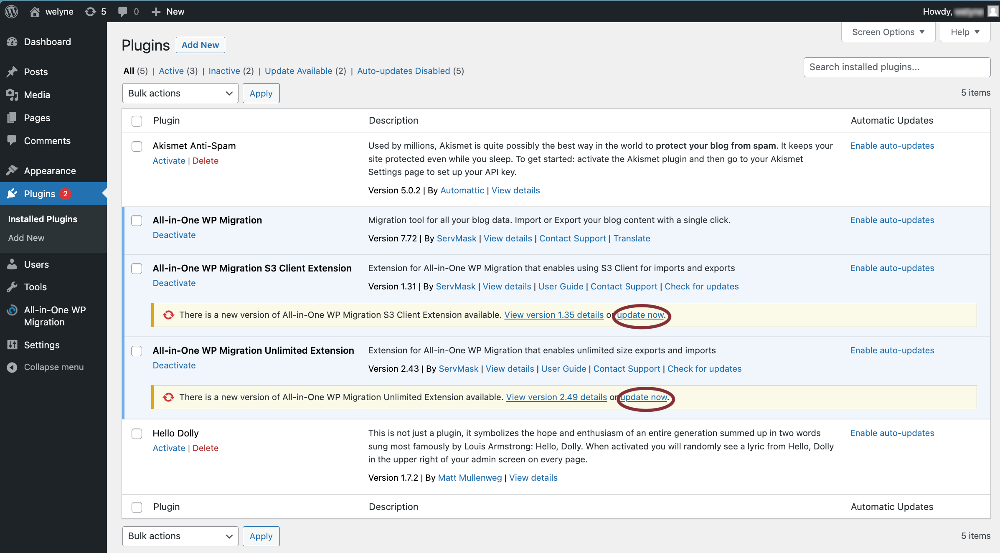
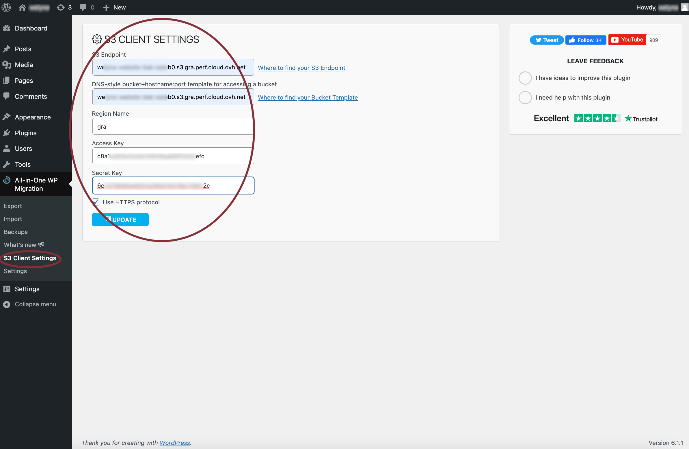
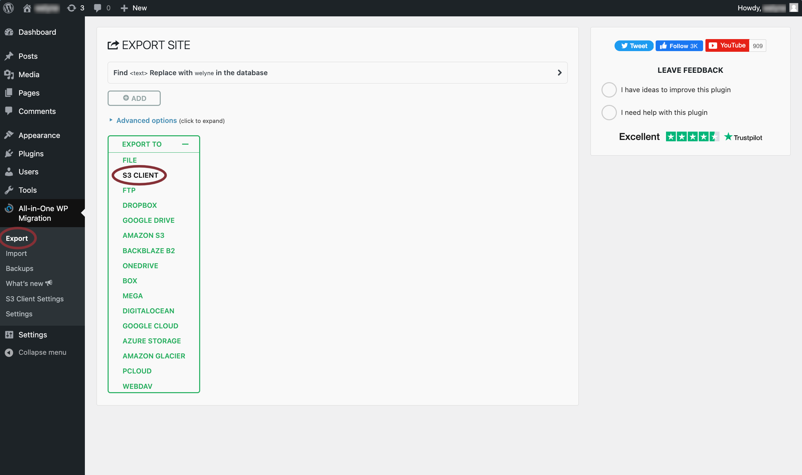
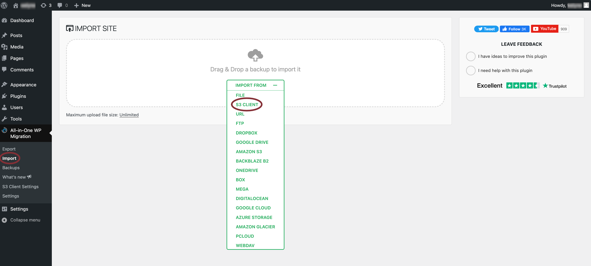
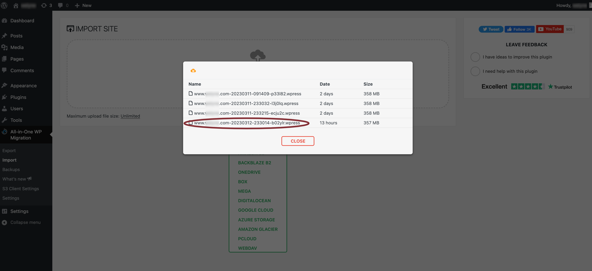
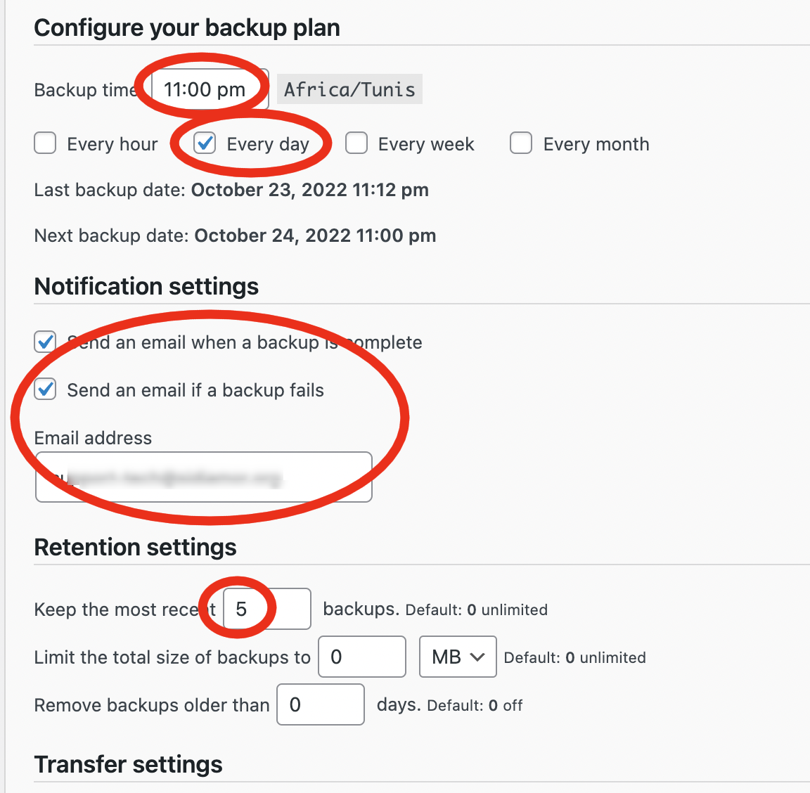

# Wordpress et matomo

## Traductions

Ce tutoriel est également disponible dans les langues suivantes :
* [English 🇬🇧](../../wpaas_matomo.md)

## Tutoriel vidéo

Ici vous trouverez une démo de comment déployer des instances [WPaaS](../../../wpaas.md)[^1] et [matomo](../../../matomo.md) dans le but d'analyser des métriques SEO:

[](https://youtu.be/klVgXyELu10)

Vous pouvez activer les sous-titres en Anglais ou Français.

[^1]: wordpress as a service

## Initialiser votre instance wordpress

Une fois que l'instance est provisionnée, vous pouvez cliquer sur le bouton `open` ici:


Cela va vous demander un nom d'utilisateur et mot de passe qui sont les suivants:

* utilisateur : `admin`
* mot de passe : `changeit`

Vous pouvez changer votre mot de passe dans le fichier `env/{env_name}.yml` :

```yaml
wp_admin_users:
  - name: admin
    passwd: $apr1$M4x65b92$KsQCdoC.BzdBcuTai2MuG0
```

Pour générer un nouveau mot de passe hashé à copier dans le champs `passwd`:

```shell
htpasswd -c .htpasswd.tmp admin
cat .htpasswd.tmp | cut -d ":" -f2 # copier la sortie de passwd
rm -rf .htpasswd.tmp
```

## Migration d'une instance de wordpress existantes sur le WPaaS de cwcloud

### Sur l'instance à déplacer

1. Créer un bucket sur cwcloud and conserver les informations de connexion (endpoint, region, access key et secret key).

Si vous êtes sur la version SaaS, vous pouvez demander un accès à l'[object storage access](../../../storage.md).

Vous trouverez les informations de connexion sur cet écran :


2. Rechercher, installer et activer l'extension "All in one migration" :


3. Téléverser, installer et activer the extensions suivantes :

* `all-in-one-wp-migration-unlimited-extension.zip`
* `all-in-one-wp-migration-s3-client-extension.zip`

De cette façon :


Ces deux extensions doivent être achetées [ici](https://servmask.com/).

Si vous êtres dans le cadre d'une prestation de service avec [comwork.io](https://www.comwork.io), vous aurez la possibilité de ré-utiliser celles que nous avons achetés pour nos clients.

Mettre à jour ces plugins si nécéssaire :



4. Configurer le bucket S3/object storage sur lequel on va envoyer la sauvegarde :



5. Lancer l'export :



### Sur la nouvelle instance

Sur la nouvelle instance que vous venez de créer : 

1. Installer les mêmes extensions

2. Configurer le même object storage que précédemment

3. Lancer l'import :



1. Choisir la sauvegarde la plus récente :



5. Configurer la sauvegarde quotidienne :



### Ré-initialiser une instance wordpress corrompue

Il faut d'abord être sûr qu'il existe des sauvegardes sur l'object storage.

Puis supprimer tout les conteneurs et volumes [en SSH](./ssh.md) ou via portainer :

```shell
docker rm -f wp_app wp_db
docker volume rm root_db_data root_wordpress_data
```

Redéployer avec ansible et restaurer depuis l'object storage (en installant le plugins etc, cf: la procédure précédente).

## Utiliser l'API d'email de comwork cloud

Vous pouvez regarder [ce tutoriel](./emailapi.md).
