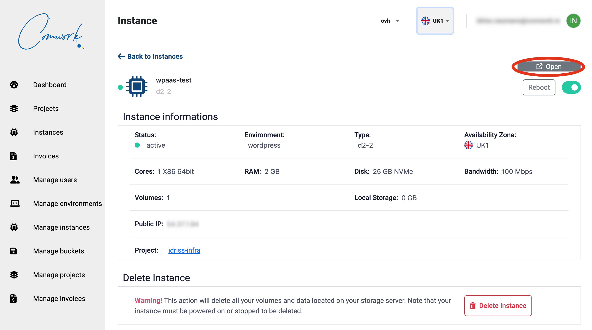

# Wordpress et matomo

## Tutoriel vidéo

Ici vous trouverez une démo de comment déployer des instances [WPaaS](../../../wpaas.md)[^1] et [matomo](../../../matomo.md) dans le but d'analyser des métriques SEO:

[](https://youtu.be/klVgXyELu10)

Vous pouvez activer les sous-titres en Anglais ou Français.

[^1]: wordpress as a service

## Initialiser votre instance wordpress

Une fois que l'instance est provisionnée, vous pouvez cliquer sur le bouton `open` ici:



Cela va vous demander un nom d'utilisateur et mot de passe qui sont les suivants:

* utilisateur : `admin`
* mot de passe : `changeit`

Vous pouvez changer votre mot de passe dans le fichier `env/{env_name}.yml` :

```yaml
wp_admin_users:
  - name: admin
    passwd: $apr1$M4x65b92$KsQCdoC.BzdBcuTai2MuG0
```

Pour générer un nouveau mot de passe hashé à copier dans le champs `passwd`:

```shell
htpasswd -c .htpasswd.tmp admin
cat .htpasswd.tmp | cut -d ":" -f2 # copier la sortie de passwd
rm -rf .htpasswd.tmp
```
