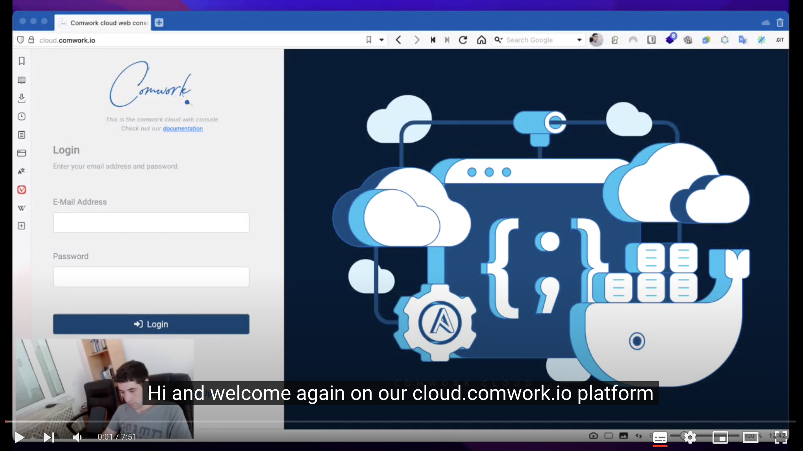
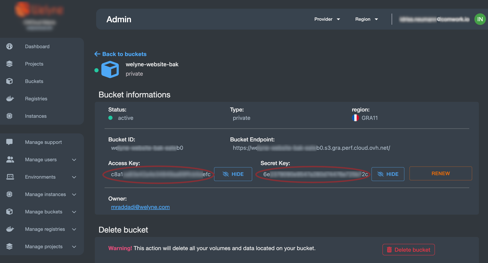
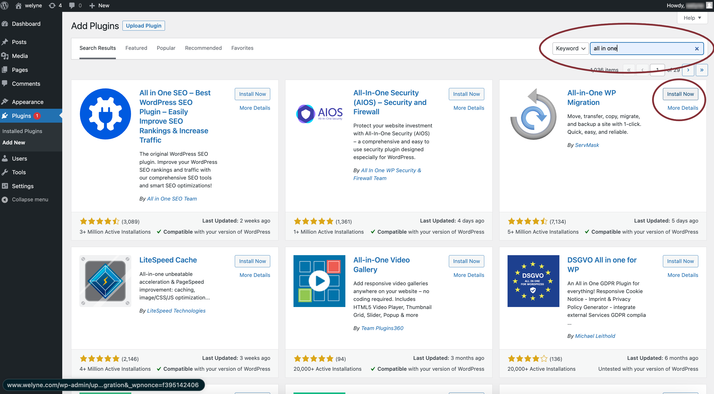
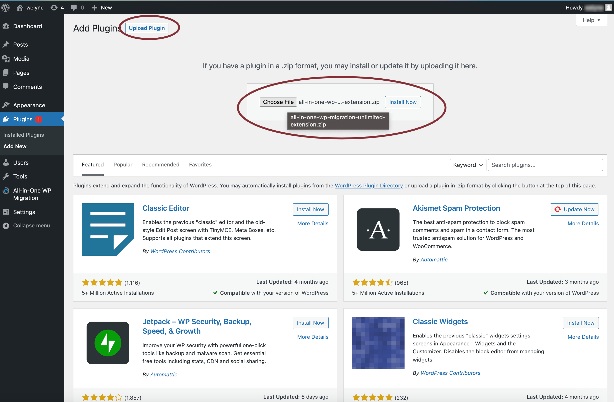

# Wordpress and matomo

## Translations

This tutorial is also available in the following languages:
* [Français 🇫🇷](./translations/fr/wpaas_matomo.md)

## Video tutorial

Here you'll find a demo on how deploying [WPaaS](../wpaas.md)[^1] and [matomo](../matomo.md) instances and order to analyze SEO insights:

[](https://youtu.be/klVgXyELu10)

You can activate the subtitles in English or French to get more details on this demo. 

Enjoy!

[^1]: wordpress as a service

## Init your wordpress instance

Once your instance is up, you can click on the `open` link here:


It'll ask for a username and password and it's the following:

* username: `admin`
* password: `changeit`

You can change your password in the `env/{env_name}.yml` file:

```yaml
wp_admin_users:
  - name: admin
    passwd: $apr1$M4x65b92$KsQCdoC.BzdBcuTai2MuG0
```

For generating a new password to copy in the `passwd` field:

```shell
htpasswd -c .htpasswd.tmp admin
cat .htpasswd.tmp | cut -d ":" -f2 # copy the output as passwd
rm -rf .htpasswd.tmp
```

## Migrate an existing Wordpress to cwcloud WPaaS

### On the old instance to move

1. Create a bucket on cwcloud and keep the endpoint, access key, secret key

If you're in the SaaS version, ask for [object storage access](../storage.md).

You'll find the credentials here:



2. Search, install and activate the "All in one migration" plugin:



3. Upload, install and activate the following extensions:

* `all-in-one-wp-migration-unlimited-extension.zip`
* `all-in-one-wp-migration-s3-client-extension.zip`

This way:



Those two extensions have to be purchased [here](https://servmask.com/).

If you're in a development contract with [comwork.io](https://www.comwork.io), we have the ability to use our own purchased one with our customers.

