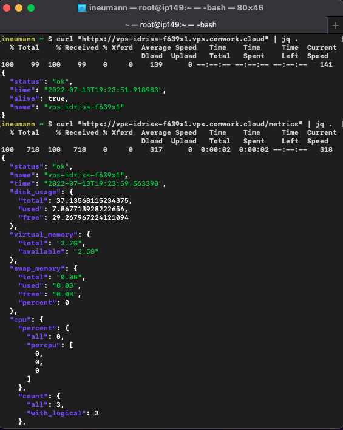

# Gateway as a service

A simple VPS that contains:

* A nginx load balancer/reverse proxy you can easily configure using ansible
* A [metrics API/exporter imalive](./tutorials/imalive.md) which is exposed with a TLS letsencrypt certificate
* A gitlab-runner that will run the ansible playbook once there is a git commit/push on the ansible configuration

## Minimal requirements

We advise to start with an instance >= [DEV1-S](./sizing_pricing.md)

## Sizing and pricing

Check it out [here](./sizing_pricing.md).
