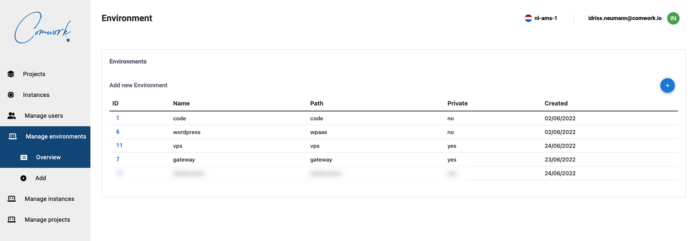

# Console

## Table of contents

[[_TOC_]]

## Public console

The console is here: https://cloud.comwork.io

First you can register and ask to the comwork team to enable your account with a conf meeting you can setup [here](https://calendly.com/idriss-neumann/intro-comwork-cloud).

Then you'll be able to create your gitlab projects:


Then your instances:


After creating your instance, you'll be able manage it from the web console:


## Administrators

### Manage environments

You can manage the environments which are a set of ansible roles and templates.



Keeping environment private will make the environment not accessible for non-admin users.


Beware of the roles order :
* `common`, `sudo`, `ssh` must be always there
* `gitlab-runner` must be the last one

If the `playbook-xxxx.yml` isn't in the right order, then you have to re-order all the roles one by one using the screen above.

You'll probably have to complete the jinja template `comwork-cloud-api/ansible/env/instance_name.yml.j2` to add the required values for your environment.

If you need to let instructions about value to change in this file, you also have a documentation template `comwork-cloud-api/ansible/env/instance_name.md.j2` to complete.

You'll also have to complete the package images inventory `/Users/ineumann/comwork-cloud-api/cloud_environments.yml` to add your environment and images:

```yaml
- environment: YOUR_ENVIRONMENT
  extra_subdomains: []
  images:
    - fr-par-1: 874c09fa-15e6-45eb-af3a-013f3318d220
    - fr-par-2: c0180f91-1ea8-4ee0-8df7-47183b8c36fc
    - nl-ams-1: 7afea3b7-d6cc-46b1-a1d9-8e60eba2c982
    - pl-waw-1: 296d036c-c0cd-478e-aad1-551d5ab95ede
```

You can re-use the `code` or `portainer` references in most of the cases.

Then, if you need to see the ansible errors for the first time:
* Create a simple VM instance (on Almalinux, last version available)
* Git clone of the gitlab repo of your project
* Then try your playbook manually and fix all the errors you'll see in the role or jinja template:

```shell
dnf update -y
dnf install -y git epel-release
dnf install -y ansible
git clone https://gitlab.comwork.io/comwork/infrastructure/dynamic/YOUR_PROJECT.git
cd YOUR_PROJECT
./install.sh -e instance-YOUR_INSTANCE -p
```

Then recreate the environment with the fixed role, order, template, whatever and retry again.
Do not forger to remove your debug compute instance.
