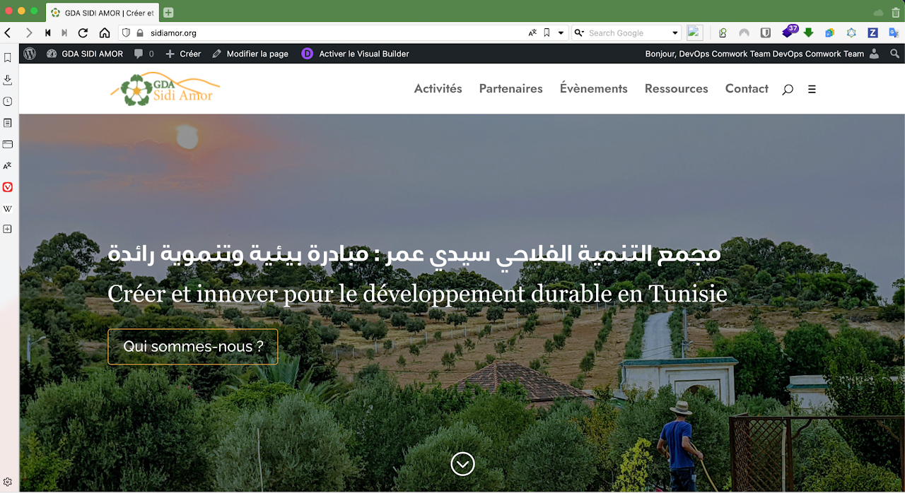

# Wordpress as a service

A secured and dedicated Wordpress instance a service.

Yet another "Wordpress as a Service" (WPaaS) with some benefits :

* It's hosted in __France__ 🇫🇷 (with [Scaleway](https://www.scaleway.com), a really beautiful French cloud provider)
* You choose the sizing of your instance as you'll pick your own VPS
* __Backups__ everyday on S3 like buckets / object storages with 3 days retention
* __Free emails__ and _SMTP_ integration with sendgrid
* Rolling upgrades of Wordpress / PHP / MySQL
* __Very strong security__: https/TLS encryption, firewalling, DDoS protection and wp-admin double authentication
* An expert _engineering team_ which is available on Slack
* SEO insights with your __Matomo__ instance (see [here](./matomo.md))

Want a meeting or a quote ? [Contact us](https://calendly.com/idriss-neumann/intro-comwork-cloud)

_One of our most valuable partner, the [GDA Sidi Amor](https://sidiamor.org) which was struggling with multiple low cost shared hosting with lots of down time, TLS certificates, very old versions of PHP or MySQL and no security and backups. They almost lost everything!_

## Table of content

[[_TOC_]]

## Sizing and pricing

Check it out [here](./sizing_pricing.md).

You can also choose to do it by yourself, it's completely free, enjoy [our repository](https://gitlab.comwork.io/oss/ansible-iac/ansible-wordpress) with the docker image and ansible role in order to install it by yourself.
