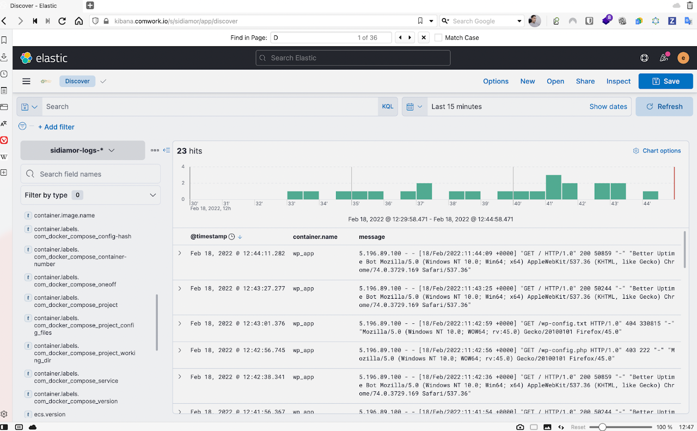

# Wordpress as a service

A secured and dedicated Wordpress instance a service.

Yet another "Wordpress as a Service" (WPaaS) with some benefits :

* It's hosted in _France_ 🇫🇷 (with [Scaleway](https://www.scaleway.com), a really beautiful French cloud provider)
* You choose the sizing of your instance as you'll pick your own VPS
* _Backups_ everyday on S3 like buckets / object storages with 3 days retention
* _Free emails_ and _SMTP_ integration with sendgrid
* Rolling upgrades of Wordpress / PHP / MySQL
* _Very strong security_: https/TLS encryption, firewalling, DDoS protection and wp-admin double authentication
* An expert _engineering team_ which is available on Slack
* SEO insights with our _Matomo_ instance for free (GPDR compliant)
* _Observability / monitoring_ of your platform with our _Elasticstack_ instance

Want a meeting or a quote ? [Contact us](https://calendly.com/idriss-neumann/intro-comwork-cloud)

*One of our most valuable partner, the [GDA Sidi Amor](https://sidiamor.org) which was struggling with multiple low cost shared hosting with lots of down time, TLS certificates, very old versions of PHP or MySQL and no security and backups. They almost lost everything!*

## Table of content

[[_TOC_]]

## SEO insights

*_SEO_ insights with our _Matomo_ shared instance*

## Platform observability

*Logs and metrics using our Kibana shared instance with 15 days of retention*

## Sizing and pricing

The instances sizing and pricing are kept up to date in this [spreadsheet](https://docs.google.com/spreadsheets/d/1rfAaCrcGInxsGCkSZyrdo2W6gZDlLQCIqnz_5qF8gBY).

You can also choose to do it by yourself, it's completely free, enjoy [our repository](https://gitlab.comwork.io/oss/ansible-iac/ansible-wordpress) with the docker image and ansible role in order to install it by yourself.
